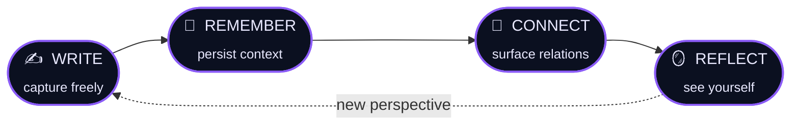
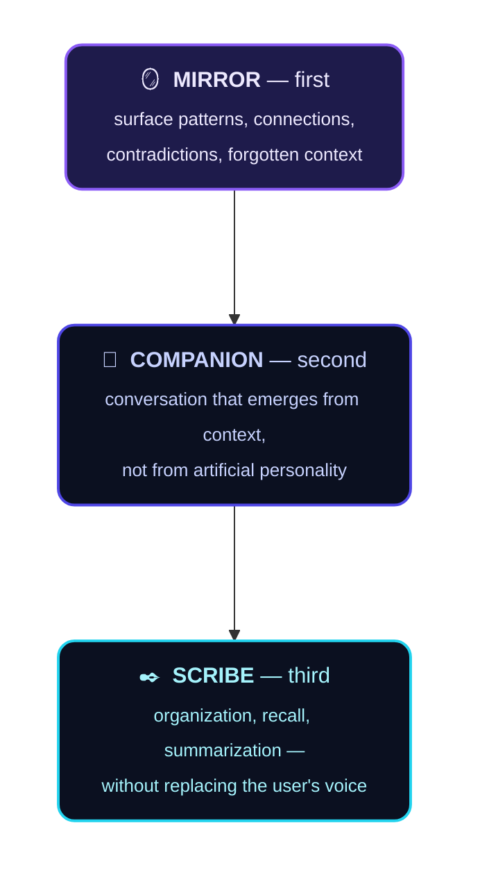
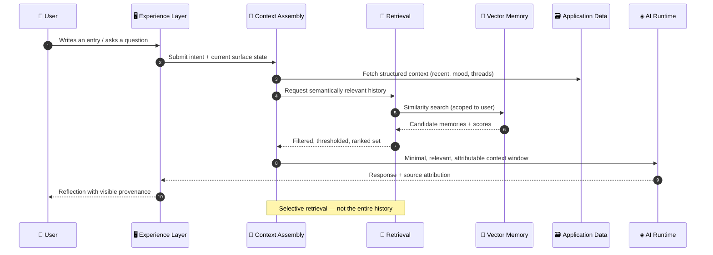
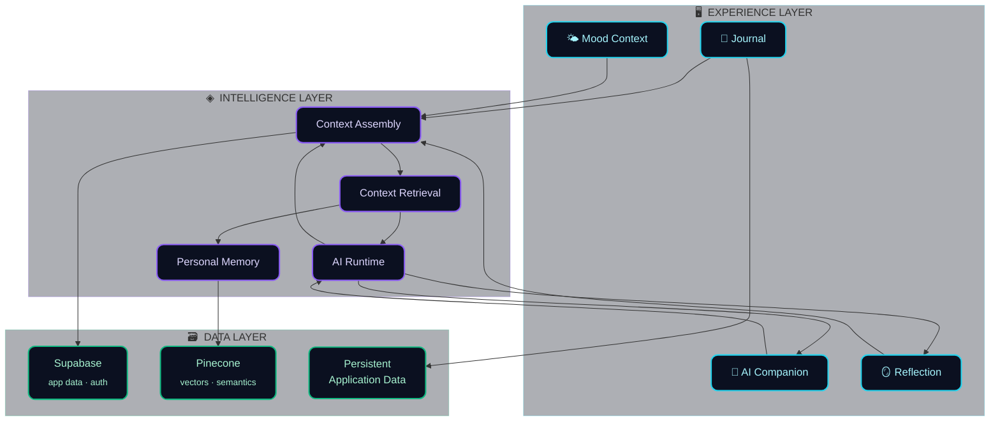
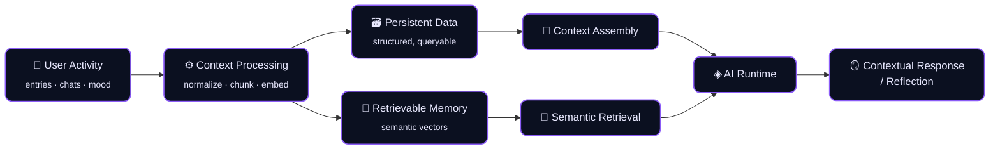
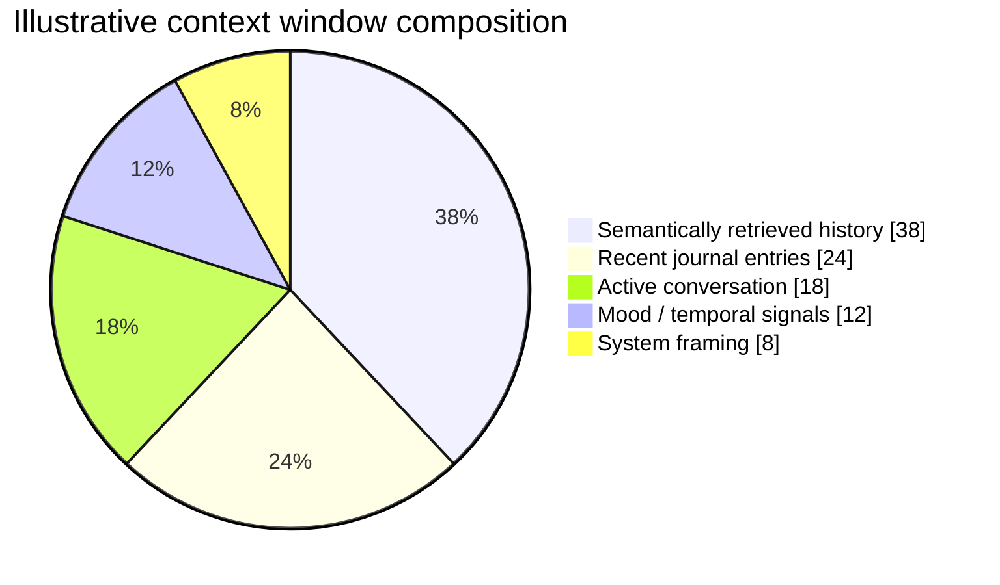
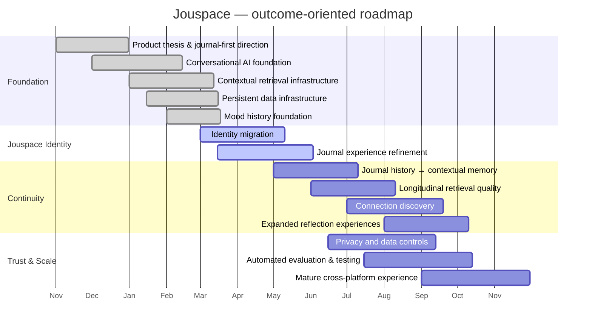
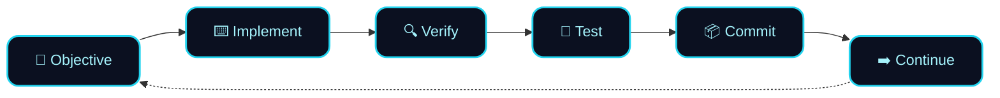

<!-- ══════════════════════════════════════════════════════════════════════════
     JOUSPACE — README
     Your thoughts, connected over time.
     ══════════════════════════════════════════════════════════════════════════ -->

<div align="center">

<a href="https://github.com/datascyther/Jouspace">
  
</a>

<br />


<br /><br />

**An open-source, AI-native journal for writing, remembering, connecting, and reflecting across your personal history.**

Jouspace brings journaling, contextual memory, mood, and AI-assisted reflection into one continuous space —
so what you write today can still be useful months from now.

<br />

<!-- ─────────────── PRIMARY BADGES ─────────────── -->

[](https://github.com/datascyther/Jouspace/stargazers)
[](https://github.com/datascyther/Jouspace/network/members)
[](https://github.com/datascyther/Jouspace/issues)
[](LICENSE)

[](https://www.typescriptlang.org/)
[](https://react.dev/)
[](https://expo.dev/)
[](https://supabase.com/)
[](https://www.pinecone.io/)
[](https://github.com/datascyther/Jouspace/pulls)

<br />

<!-- ─────────────── NAV ─────────────── -->

### [ 🧭 Thesis ](#-the-product-thesis) · [ 🔁 Core Loop ](#-the-core-loop) · [ ✨ Experiences ](#-core-experiences) · [ 🏛 Architecture ](#-system-architecture) · [ 🧠 Memory ](#-memory-architecture) · [ 🚀 Quickstart ](#-getting-started) · [ 🗺 Roadmap ](#-roadmap) · [ ⭐ Star Graphs ](#-star-growth)

<br />


</div>

<br />

## 📖 Table of Contents

<table>
<tr>
<td valign="top" width="33%">

**Product**
- [Why Jouspace exists](#-why-jouspace-exists)
- [The product thesis](#-the-product-thesis)
- [The core loop](#-the-core-loop)
- [Core experiences](#-core-experiences)
- [What makes it different](#-what-makes-jouspace-different)
- [Design language](#-design-language)

</td>
<td valign="top" width="33%">

**Engineering**
- [Intelligence model](#-jouspace-intelligence-model)
- [Anatomy of a reflection](#-anatomy-of-a-reflection)
- [System architecture](#-system-architecture)
- [Memory architecture](#-memory-architecture)
- [Technology](#-technology)
- [Repository structure](#-repository-structure)

</td>
<td valign="top" width="33%">

**Community**
- [Getting started](#-getting-started)
- [Scripts](#-available-scripts)
- [Roadmap](#-roadmap)
- [Contributing](#-contributing)
- [Responsible AI](#-responsible-ai)
- [Star growth](#-star-growth)

</td>
</tr>
</table>

<br />

---

## 🌱 Why Jouspace Exists

<table>
<tr>
<td width="50%" valign="top">

### The archive problem

Most journals are excellent at **storing** thoughts.

The problem is that stored thoughts eventually become an *archive*.

Something you wrote three months ago may perfectly explain what you're thinking today — but conventional journaling software rarely understands that relationship.

</td>
<td width="50%" valign="top">

### The amnesia problem

AI chat has almost the opposite problem.

It can be genuinely useful in the moment, yet without meaningful continuity every conversation risks becoming another **isolated interaction**.

Yesterday's insight evaporates. The context resets. You start over.

</td>
</tr>
</table>

```text
   ┌───────────────────────────────┐          ┌───────────────────────────────┐
   │        TRADITIONAL JOURNAL    │          │        TRADITIONAL AI CHAT    │
   │                               │          │                               │
   │   Jan ▓                       │          │   session ▢ ▢ ▢ ▢ ▢ ▢ ▢       │
   │   Feb ▓                       │          │            ↑                  │
   │   Mar ▓   ← never revisited   │          │            └ no continuity    │
   │   Apr ▓                       │          │                               │
   │   May ▓                       │          │   "Remind me what we…"        │
   │        ↓                      │          │   → context not found         │
   │     the archive               │          │                               │
   └───────────────────────────────┘          └───────────────────────────────┘

                        ╭──────────────────────────────╮
                        │           JOUSPACE           │
                        │                              │
                        │  Jan ▓──┐                    │
                        │  Feb ▓──┼──▶ ⟨ context ⟩ ──┐ │
                        │  Mar ▓──┤                  │ │
                        │  Apr ▓──┘                  ▼ │
                        │  May ▓ ◀────── reflection ──┘ │
                        │                              │
                        │   history that stays useful  │
                        ╰──────────────────────────────╯
```

> **Jouspace explores what happens when those two ideas are combined.**
>
> It treats your writing, conversations, mood context, and reflections as parts of a *growing personal history*.
> Instead of making AI the center of the experience, Jouspace makes **your context** the center —
> and the AI exists as a reflective layer over it.

<br />

---

## 🧭 The Product Thesis

<div align="center">


</div>

<br />

Jouspace is built around a single conviction:

> ### Personal software becomes more useful when it understands **continuity**.

<table>
<tr>
<td align="center" width="33%">

**📄**
### A journal entry
should not become irrelevant
the moment it leaves the top
of a timeline.

</td>
<td align="center" width="33%">

**💬**
### A conversation
should not automatically be
disconnected from everything
that came before it.

</td>
<td align="center" width="33%">

**🌤**
### A mood entry
should provide *context* —
not merely become another
point on a chart.

</td>
</tr>
</table>

<div align="center">

**Jouspace is designed to make accumulated history useful again.**

</div>

<br />

---

## 🔁 The Core Loop



<table>
<tr>
<th width="25%">✍️ Write</th>
<th width="25%">🧠 Remember</th>
<th width="25%">🔗 Connect</th>
<th width="25%">🪞 Reflect</th>
</tr>
<tr>
<td valign="top">

Capture thoughts freely.

Jouspace is designed around **freeform writing first**. AI prompts should support the writing process — never turn journaling into a questionnaire.

</td>
<td valign="top">

Preserve useful context across time.

Entries, conversations, and signals contribute to a **persistent personal context** instead of existing as disconnected records.

</td>
<td valign="top">

Find relationships across your history.

Past ideas, recurring themes, and emotional context become **discoverable again** exactly when they matter.

</td>
<td valign="top">

Use AI to examine your own context.

The goal is not to outsource thinking — it's to help you **look back with more context** than memory alone allows.

</td>
</tr>
</table>

<br />

---

## ✨ Core Experiences

<div align="center">

| | Surface | What it is | Role in the system |
|:--:|:--|:--|:--|
| 📓 | **Journal** | A persistent writing space built around freeform thought | The primary source of truth |
| 🤝 | **AI Companion** | Conversation connected to your broader context | User-initiated, context-aware |
| 🧠 | **Memory** | Persistent personal memory beyond chat history | Retrieval, not accumulation |
| 🔗 | **Connections** | Emergent relationships across your history | Discovery layer |
| 🌤 | **Mood Context** | A contextual signal, not the product itself | Enrichment |
| 🪞 | **Reflection** | Revisiting history with interpretation | Sits above raw storage |

</div>

<br />

<details>
<summary><b>📓 &nbsp;Journal — see the surface</b></summary>

<br />

```text
┌──────────────────────────────────────────────────────────────────────────┐
│  Jouspace ▸ Journal                                     ⌘K   ◐   ⚙︎      │
├──────────────────────────────────────────────────────────────────────────┤
│                                                                          │
│   Tuesday, 14 March                                    🌤 steady · 6/10  │
│   ────────────────────────────────────────────────────────────────────   │
│                                                                          │
│   I keep circling the same decision about the project scope. It          │
│   feels less like indecision and more like I haven't named what          │
│   I'm actually afraid of yet.▊                                           │
│                                                                          │
│                                                                          │
│   ╭─ 🔗 Related from your history ─────────────────────────────────╮     │
│   │  • 18 Nov — "scope creep and the fear of finishing"      82%  │     │
│   │  • 03 Jan — "I mistake preparation for progress"         74%  │     │
│   ╰────────────────────────────────────────────────────────────────╯     │
│                                                                          │
│   [ Save ]   [ 🪞 Reflect on this ]   [ 🤝 Ask companion ]               │
└──────────────────────────────────────────────────────────────────────────┘
```

Journal entries are **not disposable documents**. They become part of the historical context that makes future reflection more useful.

</details>

<details>
<summary><b>🤝 &nbsp;AI Companion — see the surface</b></summary>

<br />

```text
┌──────────────────────────────────────────────────────────────────────────┐
│  Jouspace ▸ Companion                              context: 4 sources ⓘ  │
├──────────────────────────────────────────────────────────────────────────┤
│                                                                          │
│   you ▸  why do I keep stalling on this?                                 │
│                                                                          │
│   ◈ jouspace                                                             │
│     You've written about this shape of hesitation three times            │
│     since November. Each time it appeared right before a                 │
│     commitment became public rather than private.                        │
│                                                                          │
│     ╭ drawn from ─────────────────────────────────────────────╮          │
│     │ 📓 18 Nov entry   📓 03 Jan entry   🌤 Mar mood window   │          │
│     ╰──────────────────────────────────────────────────────────╯         │
│                                                                          │
│     Would it help to look at what changed the one time you               │
│     didn't stall?                                                        │
│                                                                          │
│   ▸ type a message…                                          [ send ]    │
└──────────────────────────────────────────────────────────────────────────┘
```

The companion is **primarily user-initiated** and cites the context it used.

</details>

<details>
<summary><b>🧠 &nbsp;Memory & Connections — see the surface</b></summary>

<br />

```text
   RELEVANCE MAP ─ query: "fear of finishing"

   18 Nov · scope creep            ████████████████████░░░░  0.82   📓
   03 Jan · preparation ≠ progress ██████████████████░░░░░░  0.74   📓
   27 Feb · companion thread       ████████████░░░░░░░░░░░░  0.51   💬
   09 Mar · mood dip window        ████████░░░░░░░░░░░░░░░░  0.34   🌤
   ─────────────────────────────────────────────────────────────────
   retrieved: 3 · discarded: 1 (below threshold)
```

**Retrieve what matters, when it matters.** Not every stored event deserves permanent attention.

</details>

<br />

---

## 🔍 What Makes Jouspace Different?

Jouspace is **not simply a journal with an AI chat box attached to it**. Its architecture is being developed around *longitudinal context*.

<div align="center">

| | 🗄 Conventional approach | ◈ Jouspace approach |
|:--:|:--|:--|
| **Entries** | Become an archive | Contribute to persistent context |
| **AI** | Reacts to the current prompt | Reasons over relevant historical context |
| **Mood** | Is treated as the product | Acts as supporting context |
| **Chat** | Is the primary experience | Exists across the broader product |
| **Memory** | Means chat history | Means useful personal context |
| **Engagement** | AI constantly tries to engage | User agency remains central |
| **Structure** | Journaling built around prompts | Freeform writing comes first |

</div>

<div align="center">

> ### The objective is not *more AI*. The objective is **better continuity**.

</div>

<br />

---

## 🪞 Jouspace Intelligence Model

<div align="center">

## Mirror first · Companion second · Scribe third

</div>



<br />

---

## 🔬 Anatomy of a Reflection

What actually happens between *"help me understand this"* and a grounded answer:



<br />

---

## 🏛 System Architecture

Jouspace deliberately separates the **product experience** from the **intelligence** and **persistence** layers.



> **The important distinction:** memory, retrieval, and generation are **separate concerns**.
> This makes it possible to retrieve relevant context *selectively*, instead of treating every previous
> interaction as permanent prompt baggage.

<br />

---

## 🧠 Memory Architecture

A useful personal AI system needs more than a long chat transcript. Conceptually, Jouspace treats memory as a **pipeline**.



### How context budget is allocated



<div align="center">

> ### Retrieve what matters, **when** it matters.
> Not every stored event deserves permanent attention.

</div>

<br />

---

## 🎨 Design Language

The Jouspace surface is intentionally quiet: **ink-dark canvas, low-noise typography, one accent of intelligence.**

<div align="center">


</div>

| Principle | In practice |
|:--|:--|
| **Quiet canvas** | Nothing competes with the sentence you're writing |
| **Provenance visible** | Whenever AI uses your history, the source is shown |
| **Motion with meaning** | Transitions signal continuity, never decoration |
| **Type as texture** | A single serif/mono pairing carries the whole surface |
| **Accessible by default** | Contrast, focus rings, and reduced-motion are requirements |

<br />

---

## 🛠 Technology

Jouspace is being built as a **full-stack AI product**, not a thin interface around a model API.

<div align="center">


</div>

<table>
<tr>
<th width="34%">🖥 Application</th>
<th width="33%">🧠 Data & Intelligence</th>
<th width="33%">🧪 Engineering</th>
</tr>
<tr>
<td valign="top">

- **React 19** — primary web UI
- **React Native** — cross-platform architecture
- **Expo** — native tooling
- **TypeScript** — type-safe development
- **Vite** — dev server & production builds
- **NativeWind / Tailwind** — UI styling
- **Zustand** — client state
- **TanStack Query** — server-state

</td>
<td valign="top">

- **Supabase** — application data & auth
- **Pinecone** — vector retrieval & semantic memory
- **LLM runtime** — contextual generation & reflection
- **RAG** — selective retrieval of relevant context

</td>
<td valign="top">

- **Vitest** — unit & integration testing
- **Zod** — runtime validation
- **GitHub** — source control & collaboration
- Incremental, verify-before-commit workflow

</td>
</tr>
</table>

<br />

---

## 🗂 Repository Structure

The project is evolving, but the repository broadly separates product surfaces, shared logic, backend infrastructure, AI services, and supporting scripts.

```text
Jouspace/
│
├── 📁 src/                 # Web application and shared product code
├── 📁 app/                 # Application routes / experiences
├── 📁 components/          # Reusable interface components
├── 📁 backend/             # Backend and AI infrastructure
├── 📁 scripts/             # Development and infrastructure utilities
├── 📁 docs/                # Technical and product documentation
├── 📁 public/              # Public assets
│
├── 📄 package.json
└── 📄 README.md
```

> ℹ️ The exact structure may evolve as the Jouspace migration and architecture continue to mature.

<br />

---

## 🚀 Getting Started

<div align="center">


</div>

### Prerequisites


```bash
node --version   # v20+
npm --version
git --version
```

### 1 · Clone the repository

```bash
git clone https://github.com/datascyther/Jouspace.git
cd Jouspace
```

### 2 · Install dependencies

```bash
npm install
```

### 3 · Configure the environment

Jouspace relies on external services for parts of its data and intelligence infrastructure.
Create your local environment configuration from the templates and documentation in the repository.

> ⚠️ **Never commit secrets or API keys to source control.**

### 4 · Run the web application

```bash
npm run dev        # start the Vite development server
npm run build      # create a production build
npm run preview    # preview the production build
```

<details>
<summary><b>📱 &nbsp;Running the native app (Expo)</b></summary>

<br />

```bash
npm run dev:expo   # start the Expo development environment
npm run android    # run on Android
npm run ios        # run on iOS
npm run web:expo   # Expo web target
```

</details>

<details>
<summary><b>🧠 &nbsp;Initializing memory & retrieval infrastructure</b></summary>

<br />

```bash
npm run rag:ingest          # run the RAG ingestion workflow
npm run pinecone:describe   # inspect Pinecone configuration
npm run pinecone:stats      # inspect index statistics
```

</details>

<br />

---

## ⚡ Available Scripts

| Command | Purpose |
|:--|:--|
| `npm run dev` | Start the Vite development server |
| `npm run build` | Create the production web build |
| `npm run preview` | Preview the production build |
| `npm run test` | Run the test suite |
| `npm run test:integration` | Run backend integration tests |
| `npm run dev:expo` | Start the Expo development environment |
| `npm run android` | Run the Android application |
| `npm run ios` | Run the iOS application |
| `npm run web:expo` | Start the Expo web target |
| `npm run rag:ingest` | Run the RAG ingestion workflow |
| `npm run pinecone:describe` | Inspect Pinecone configuration |
| `npm run pinecone:stats` | Inspect Pinecone index statistics |

<br />

---

## 🧱 Product Principles

Seven constraints that shape both product and engineering decisions.

<table>
<tr>
<td width="50%" valign="top">

**01 · Journal first**
Writing should remain useful without requiring an AI interaction.

**02 · Context over conversation volume**
A system that remembers meaningfully doesn't need to talk constantly.

**03 · User agency**
The AI should not manufacture engagement merely because it can.

**04 · Memory should be selective**
More stored information does not automatically produce better intelligence. *Relevant* retrieval matters more than *maximum* retrieval.

</td>
<td width="50%" valign="top">

**05 · AI should support reflection**
Jouspace should help you think *with* your own history — not attempt to think *for* you.

**06 · Mood is context**
Mood can enrich understanding without turning Jouspace into a mood-tracking product.

**07 · Privacy is architectural**
Personal context is unusually sensitive data. Privacy, ownership, retrieval boundaries, and secure handling are **engineering concerns**, not marketing copy.

</td>
</tr>
</table>

<br />

---

## 🚫 What Jouspace Is Not

<div align="center">


</div>

Jouspace is an **experimental open-source AI product** focused on journaling, personal context, memory, and reflection.
If you are in crisis, please contact local emergency services or a qualified professional.

<br />

---

## 📊 Project Status

> **Jouspace is under active development.** The project is evolving from an earlier product direction into the Jouspace architecture and identity.

```text
CONVERSATIONAL AI          ████████████████████░░░░   built · refining
CONTEXTUAL RETRIEVAL       ██████████████████░░░░░░   built · refining
PERSONAL MEMORY            ██████████████░░░░░░░░░░   in progress
JOURNALING SURFACE         ████████████████░░░░░░░░   in progress
MOOD HISTORY               ██████████████████░░░░░░   foundation done
AUTHENTICATION             ██████████████████████░░   stable
APP INFRASTRUCTURE         ████████████████████░░░░   stable
CROSS-PLATFORM UI          ████████████░░░░░░░░░░░░   maturing
AI ORCHESTRATION           ████████████████░░░░░░░░   in progress
IDENTITY MIGRATION         ██████████░░░░░░░░░░░░░░   underway
```

Current work focuses on **integrating existing systems around the new product thesis** — not rebuilding the application for the sake of a rebrand.

> ⚠️ APIs, interfaces, architecture, and product behavior may change while the project matures.

<br />

---

## 🗺 Roadmap



<details>
<summary><b>✅ &nbsp;Roadmap as a checklist</b></summary>

<br />

- [x] Establish Jouspace product thesis
- [x] Define journal-first product direction
- [x] Build conversational AI foundation
- [x] Build contextual retrieval infrastructure
- [x] Establish persistent data infrastructure
- [x] Implement mood history foundation
- [ ] Complete Jouspace identity migration
- [ ] Refine journal experience
- [ ] Connect journal history to contextual memory
- [ ] Improve longitudinal retrieval
- [ ] Develop connection discovery
- [ ] Expand reflection experiences
- [ ] Strengthen privacy and data controls
- [ ] Expand automated evaluation and testing
- [ ] Mature cross-platform experience

</details>

> The roadmap is intentionally **outcome-oriented**. Features may change as the underlying product model is tested.

<br />

---

## 🧭 Engineering Philosophy



Large architectural rewrites are avoided when existing engineering can be evolved safely.

The repository is intended to document not only the final product, but also **the engineering decisions required to build a context-aware AI application responsibly.**

<br />

---

## 🤝 Contributing

Contributions, technical discussion, bug reports, and thoughtful product feedback are genuinely welcome.

<details open>
<summary><b>Development workflow</b></summary>

<br />

```bash
# 1 · Fork, then branch
git checkout -b feature/your-feature

# 2 · Make your changes, then verify
npm run test
npm run build

# 3 · Commit with a clear, conventional message
git commit -m "feat: describe your change"

# 4 · Push and open a Pull Request
git push origin feature/your-feature
```

Your PR description should explain:

| | |
|:--|:--|
| **What** | changed |
| **Why** | it changed |
| **How** | it was tested |
| **Impact** | any architectural implications |

</details>

### Contribution principles

<div align="center">


</div>

> For substantial architectural changes, please open an issue for discussion **before** implementation.

<br />

---

## 🔐 Security

> **Do not report security vulnerabilities through public GitHub issues.**

- Sensitive credentials, API keys, private user information, environment files, and production secrets must **never** be committed.
- When working with Jouspace's memory and context systems, assume that stored personal information **is** sensitive and design accordingly.
- Retrieval must always be scoped to the owning user. Cross-user leakage is treated as a critical defect.

<br />

---

## ⚖️ Responsible AI

Jouspace deals with personal writing and contextual information, which creates responsibilities beyond ordinary application development.

<table>
<tr>
<td width="50%" valign="top">

- AI-generated output should **not** be presented as objective truth
- Historical context can be incomplete or misinterpreted
- Retrieved memories should remain **attributable** to user context where practical
- AI should avoid pretending to possess human memory or emotions

</td>
<td width="50%" valign="top">

- User control takes priority over artificial engagement
- Sensitive personal context should be retrieved **only when relevant**
- The product should remain transparent about what AI can and cannot infer
- Reflection is offered, never imposed

</td>
</tr>
</table>

<div align="center">

> ### The objective is not to create an artificial person.
> ### It is to build better software for working with personal context.

</div>

<br />

---

## ⭐ Star Growth

If Jouspace is useful to you, starring the repository helps other developers discover the project — and gives us a pleasantly primitive but highly effective signal that someone on the internet cared.

<div align="center">

<a href="https://star-history.com/#datascyther/Jouspace&Date">
  <picture>
    <source media="(prefers-color-scheme: dark)" srcset="https://api.star-history.com/svg?repos=datascyther/Jouspace&type=Date&theme=dark" />
    <source media="(prefers-color-scheme: light)" srcset="https://api.star-history.com/svg?repos=datascyther/Jouspace&type=Date" />
    
  </picture>
</a>

<br /><br />

<details>
<summary><b>📈 &nbsp;More star & growth visualizations</b></summary>

<br />

**Cumulative stargazers (Starchart)**

<a href="https://starchart.cc/datascyther/Jouspace">
  
</a>

<br /><br />

**Repository pulse — commits, issues, PRs & contributors**

<a href="https://github.com/datascyther/Jouspace/pulse">
  
</a>

<br /><br />

**Contribution activity graph**


</details>

<br />

<a href="https://github.com/datascyther/Jouspace/stargazers">
  
</a>

</div>

<br />

---

## 📡 Repository Activity

<div align="center">

[](https://github.com/datascyther/Jouspace/stargazers)
[](https://github.com/datascyther/Jouspace/network/members)
[](https://github.com/datascyther/Jouspace/issues)
[](https://github.com/datascyther/Jouspace/pulls)

[](https://github.com/datascyther/Jouspace/commits)
[](https://github.com/datascyther/Jouspace/pulse)
[](https://github.com/datascyther/Jouspace)
[](https://github.com/datascyther/Jouspace)
[](https://github.com/datascyther/Jouspace/graphs/contributors)

<br />

### 👥 Contributors

<a href="https://github.com/datascyther/Jouspace/graphs/contributors">
  
</a>

</div>

<br />

---

## ❓ FAQ

<details>
<summary><b>Is my journal data sent to an AI model on every request?</b></summary>
<br />
No. Context is <i>assembled selectively</i>. Retrieval is thresholded and ranked, and only relevant, scoped context reaches the model. Maximum retrieval is explicitly an anti-goal.
</details>

<details>
<summary><b>Can I use Jouspace purely as a journal, with no AI?</b></summary>
<br />
Yes — that is principle #1. Writing must remain useful without any AI interaction. AI is a layer <i>over</i> your context, never a gate in front of it.
</details>

<details>
<summary><b>How is this different from an AI chatbot with long-term memory?</b></summary>
<br />
Chat is one surface, not the product. Jouspace's center of gravity is your writing and the accumulated context around it — journal, mood, reflections, and connections — with chat as one of several ways to interrogate that history.
</details>

<details>
<summary><b>Is mood tracking required?</b></summary>
<br />
No. Mood is a contextual signal that enriches retrieval and reflection. Jouspace is deliberately not a mood-tracking product.
</details>

<details>
<summary><b>Is Jouspace production-ready?</b></summary>
<br />
Not yet. It is under active development and migrating from an earlier product direction. Expect interfaces and behavior to change.
</details>

<br />

---

## 📜 License

This project is licensed under the terms provided in the repository's [**LICENSE**](LICENSE) file.

Please review the license before redistributing, modifying, or incorporating Jouspace into another project.

<br />

---

<div align="center">


<br />

# Jouspace

### ✍️ Write → 🧠 Remember → 🔗 Connect → 🪞 Reflect

**Your thoughts should become more useful with time — not disappear into an archive.**

<br />

[](https://github.com/datascyther/Jouspace)
[](https://github.com/datascyther/Jouspace/issues)
[](https://github.com/datascyther/Jouspace/pulls)
[](https://github.com/datascyther/Jouspace/discussions)

<br />

Built in public as an open-source exploration of **AI, memory, personal context, and reflective software.**

<br />


</div>
