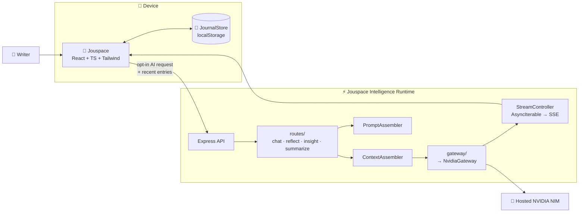
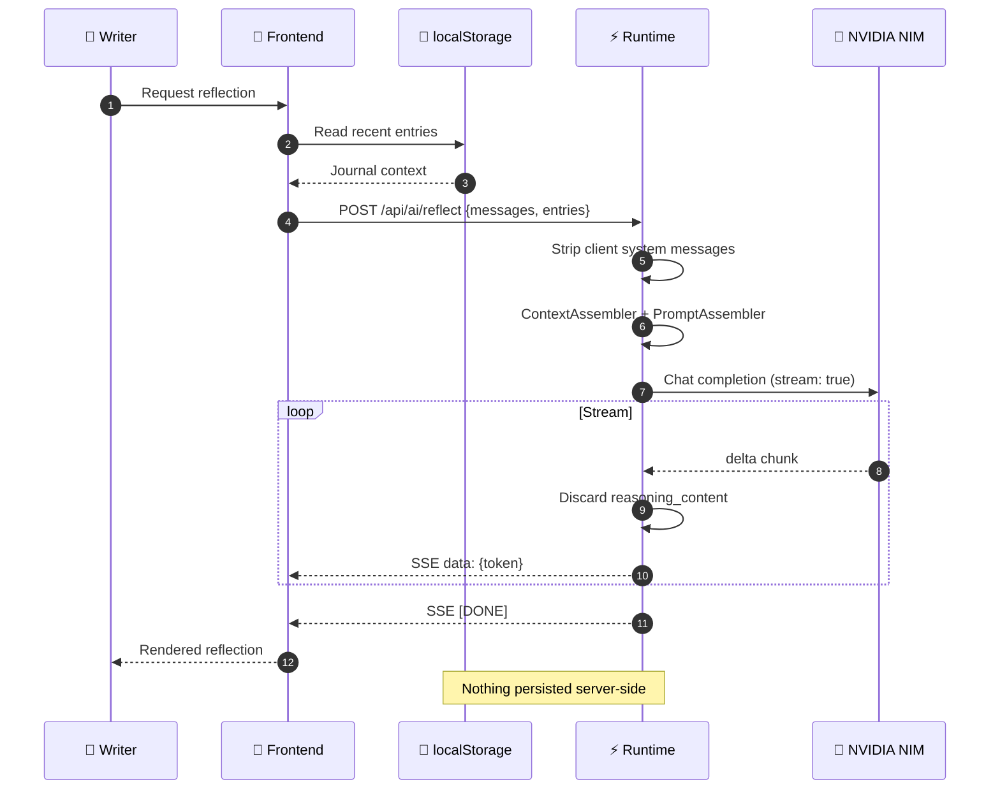

<a id="top"></a>

<div align="center">


<br />

# 📖 **Jouspace**

### ✨ AI-Native Private Journal

> *A calm place to write. Local-first storage. Opt-in AI reflection.*
>
> **Web · PWA · Android**

<br />

<p>
  <a href="https://github.com/datascyther/Jouspace/releases">
    
  </a>
  <a href="https://github.com/datascyther/Jouspace/actions/workflows/build-apk.yml">
    
  </a>
  <a href="./LICENSE">
    
  </a>
</p>

<p>
  
  
  
  
  
  
  
  
</p>

<br />

<p>
  <a href="#-quick-start"><b>🚀 Quick Start</b></a>
  &nbsp;·&nbsp;
  <a href="#-features"><b>✨ Features</b></a>
  &nbsp;·&nbsp;
  <a href="#-architecture"><b>🏗️ Architecture</b></a>
  &nbsp;·&nbsp;
  <a href="#-android-build"><b>📱 Android Build</b></a>
  &nbsp;·&nbsp;
  <a href="#-privacy"><b>🔒 Privacy</b></a>
  &nbsp;·&nbsp;
  <a href="./DEPLOYMENT.md"><b>📖 Deployment</b></a>
</p>

<br />

---

<div align="center">

> ### 💭 **"Your journal should feel personal, quiet, and yours."**
>
> Entries stay on your device by default.
> **Nothing is sent anywhere until you ask the AI a question.**

</div>

---

## ☀️ **At a Glance**

<div align="center">

| **Aspect**       | **Detail**                                                                 |
|------------------|---------------------------------------------------------------------------|
| **Purpose**      | Private journaling with optional AI reflection                            |
| **Storage**      | `localStorage` on your device — no account, no cloud DB                   |
| **AI Flow**      | Client → Runtime → NVIDIA NIM → **SSE Stream**                            |
| **Platforms**    | Browser · PWA · Signed Android APK                                         |
| **Backend**      | Stateless Express server — **no database required**                     |

</div>

> [!IMPORTANT]
> Jouspace is designed to *feel* on-device, but inference runs on the configured remote runtime.
> **AI is entirely optional** — the journal works fully without it.

---

## ✨ **Features**

<div align="center">

| 🔒 **Privacy-First**               | 🤖 **Optional AI**                     | ⚡ **Streaming**                     |
|-----------------------------------|---------------------------------------|------------------------------------|
| Entries in `localStorage`          | AI tab inert until configured          | All responses via **SSE**          |
| ✅ No account                      | ✅ Opt-in                             | ✅ Live & conversational            |
| ✅ No sync server                  | ✅ Per request                        | ✅ Responsive                      |
| ✅ Nothing to breach               | ✅ Never in background                |                                    |

| 📦 **Single File**                | 📱 **Android Ready**                  | 🔄 **Portable**                     |
|-----------------------------------|---------------------------------------|------------------------------------|
| `vite-plugin-singlefile`          | Committed Capacitor platform          | JSON export/import                 |
| ✅ Entire app in `index.html`      | ✅ Branded icons                      | ✅ `JournalStore` ready             |
| ✅ Offline-safe                    | ✅ Native permissions                 | ✅ Future cloud sync                |
|                                   | ✅ Release signing                    |                                    |

</div>

---

## 🌐 **Project Links**

| **Resource**               | **Address**                                                                 |
|---------------------------|-----------------------------------------------------------------------------|
| **📦 Repository**          | [github.com/datascyther/Jouspace](https://github.com/datascyther/Jouspace) |
| **⚡ Live AI Runtime**     | [jouspace-runtime.jouspace.workers.dev](https://jouspace-runtime.jouspace.workers.dev) |
| **📱 Releases / APKs**    | [github.com/datascyther/Jouspace/releases](https://github.com/datascyther/Jouspace/releases) |
| **📖 Deployment Guide**   | [`DEPLOYMENT.md`](./DEPLOYMENT.md)                                       |

---

## 🛠️ **Technology Stack**

<div align="center">

| **Layer**               | **Technology**                                                                 |
|-------------------------|-------------------------------------------------------------------------------|
| **Frontend**            | React 19 · TypeScript · Vite 7 · Tailwind CSS 4                              |
| **Build**               | `vite-plugin-singlefile` — entire app in one `dist/index.html`               |
| **PWA**                 | Manifest + icons + self-hosted fonts (offline-safe)                         |
| **AI Runtime**          | Express 4 + OpenAI SDK (NVIDIA NIM gateway) + SSE streaming                 |
| **Hosting**             | Cloudflare Workers                                                          |
| **Mobile**              | Capacitor with committed `android/` platform                                |
| **Auth** *(optional)*   | Firebase Auth — Google + email/password, identity only                       |
| **Storage**             | Local-first via `localStorage` (`src/store/`)                               |

</div>

---

## 📚 **Table of Contents**

<div align="center">

| **Part 1**                          | **Part 2**                          |
|-------------------------------------|-------------------------------------|
| [🚀 Quick Start](#-quick-start)     | [🏗️ Architecture](#-architecture)   |
| [✨ AI Capabilities](#-ai-capabilities) | [⚙️ Runtime Config](#-runtime-configuration) |
| [📱 Android Build](#-android-build) | [📊 Versioning](#-versioning)       |
| [🏭 Production](#-production)        | [💻 Scripts](#-scripts)             |
| [🔒 Security](#-security)           | [🛡️ Privacy](#-privacy) · [📜 License](#-license) |

</div>

---

<a id="quick-start"></a>

## 🚀 **Quick Start**

> **Prerequisites** — Node.js 20+ · npm · *(Android only)* JDK 17 + Android SDK

### **1️⃣ Clone Repository**

```bash
git clone https://github.com/datascyther/Jouspace.git
cd Jouspace
```

### **2️⃣ Install Dependencies**

```bash
npm install                # Frontend
cd server && npm install   # Intelligence Runtime
cd ..
```

### **3️⃣ Configure Runtime**

Create `server/.env` **(gitignored)**:

```dotenv
NVIDIA_API_KEY=your_nvidia_nim_key
```

> ⚠️ **Never commit this file** — it contains your model provider credentials.

### **4️⃣ Launch Development Environment**

```bash
npm run dev:all    # Vite + Runtime, together
```

| **Service**            | **Address**          |
|------------------------|----------------------|
| 🌐 **Frontend**        | http://localhost:5173 |
| ⚡ **Runtime**         | http://localhost:3001 |

> ℹ️ In development, frontend calls `/api/ai/*` on its own origin; Vite proxies to `localhost:3001`.

---

<a id="architecture"></a>

## 🏗️ **Architecture**

### **🔄 System Overview**



### **🔍 Sequence Diagram**

<details>
<summary><b>👁️ Click to expand: What happens during an AI request</b></summary>
<br />


</details>

---

### **📂 Frontend Structure**

```text
Frontend (React)
├── useJouspaceIntelligence(capability) → POST {runtime}/api/ai/<capability>
├── 💬 AI chat
├── 📝 Reflection drawer
├── 💡 Insight cards
├── 📊 Writing summary
├── 📒 JournalStore (localStorage, src/store/)
└── Configurable API base URL (VITE_API_BASE_URL)
```

**Key behaviors:**
✅ Stores entries locally
✅ Selects recent entries as AI context
✅ Consumes AI output as SSE stream
✅ Keeps AI optional and decoupled

---

### **⚙️ Runtime Structure**

```text
Intelligence Runtime (Express, server/)
├── routes/          # chat · reflect · insight · summarize (all SSE)
├── ContextAssembler # journal context from client entries (seeded if absent)
├── PromptAssembler  # Jouspace-branded system prompts
├── gateway/         # provider abstraction (NvidiaGateway = live)
└── StreamController # AsyncIterable → SSE
```

**Key behaviors:**
✅ Stateless by design
✅ No database required
✅ Falls back to seed data only when client sends no entries

---

<a id="ai-capabilities"></a>

## ✨ **AI Capabilities**

All capabilities exposed via:

```http
POST /api/ai/<capability>
Content-Type: application/json
Accept: text/event-stream
```

| **Capability** | **Purpose**                          | **Transport** |
|----------------|--------------------------------------|---------------|
| `chat`         | Conversational exploration           | SSE           |
| `reflect`      | Calm reflection on entry/writing    | SSE           |
| `insight`      | Extract themes & patterns            | SSE           |
| `summarize`    | Concise summary of recent activity   | SSE           |

---

<a id="runtime-configuration"></a>

## ⚙️ **Runtime Configuration**

### **🔧 Development**

```text
Frontend /api/ai/* → Vite proxy → localhost:3001
```
*No environment variable needed.*

### **🌍 Production**

Set `VITE_API_BASE_URL` when building:

```bash
VITE_API_BASE_URL=https://your-runtime.example npm run build
```

For hosted runtime:

```bash
VITE_API_BASE_URL=https://jouspace-runtime.jouspace.workers.dev npm run build
```

> ℹ️ **Note:** Builds can ship **without** a default runtime, leaving AI inert until user configures in Profile.

### **🔐 CORS**

Already allowed (Android WebView origins):

```text
capacitor://localhost
https://localhost
```

Add others via `CORS_ORIGINS`:

```dotenv
CORS_ORIGINS=https://journal.example.com,https://preview.example.com
```

---

<a id="android-build"></a>

## 📱 **Building the Android APK**

The `android/` platform is **committed** with:
🎨 Branded icons · 🔐 Native permissions · ⚙️ Capacitor config · 🔑 Release signing · 📦 Gradle pipeline

**Web app → single `dist/index.html` → Capacitor sync → native shell**

---

### **🤖 Option A: GitHub Actions** *(Recommended)*

Zero local Android setup:

1. Push repo to GitHub
2. **Actions** → **Build Android APK**
3. **Run workflow**
4. Download `jouspace-release.apk` from **Artifacts**

**Workflow:** `.github/workflows/build-apk.yml`

**Pipeline:**
```text
install deps → build web → cap sync → stamp version → assembleRelease → upload
```

**Version from tag:**
```text
v1.1.0-beta.1
├── versionName: 1.1.0-beta.1
└── versionCode: 11001
```

---

### **💻 Option B: Local Build**

**Requires:** JDK 17 + Android SDK

```bash
npm run build
npx cap sync android
cd android && ./gradlew assembleRelease
```

**Output:** `android/app/build/outputs/apk/release/app-release.apk`

> ⚠️ **Warning:** Preserve your release keystore — losing it prevents updates.

---

<a id="versioning"></a>

## 📊 **Versioning**

Semantic Versioning with `-beta.N` prereleases.

| **Git Tag**       | **`versionName`** | **`versionCode`** |
|-------------------|-------------------|-------------------|
| `v1.1.0-beta.1`   | `1.1.0-beta.1`    | `11001`           |
| `v1.1.0-beta.2`   | `1.1.0-beta.2`    | `11002`           |
| `v1.1.0`          | `1.1.0`           | `11100`           |

---

### **🔢 Version Code Formula**

```text
versionCode = MAJOR×10000 + MINOR×1000 + PATCH×100 + iteration
```

| **Release Type** | **`iteration`** |
|------------------|-----------------|
| Beta `-beta.N`   | `01`–`99`       |
| Stable           | `100`           |

---

### **📜 Release Rules**

1. **Increment beta number:** `1.1.0-beta.1` → `1.1.0-beta.2`
2. **Drop suffix for stable:** `1.1.0-beta.3` → `1.1.0`
3. **Sync `package.json`** version with `versionName`
4. **Trigger via tag:**
   ```bash
   git tag v1.1.0-beta.1
   git push origin v1.1.0-beta.1
   ```
5. **Or use Actions UI:** **Build Android APK** → manual version input

**Full scheme:** [`DEPLOYMENT.md` §2.2](./DEPLOYMENT.md)

---

<a id="production"></a>

## 🏭 **Production & Deployment**

<details>
<summary><b>🚀 Deployment</b></summary>
<br />
See [`DEPLOYMENT.md`](./DEPLOYMENT.md) for:
✅ Cloudflare Workers hosting
✅ Runtime environment variables
✅ APK release signing
✅ Keystore management
✅ Current auth status
</details>

<details>
<summary><b>⚙️ Backend</b></summary>
<br />
Deploy runtime to Cloudflare Workers:

```bash
VITE_API_BASE_URL=https://jouspace-runtime.<sub>.workers.dev npm run build
```

**Stateless design:**
✅ No database required
✅ Context from client requests
✅ Seed fallback only
✅ Credentials stay server-side
</details>

<details>
<summary><b>💾 Data Model</b></summary>
<br />
Frontend persists in `localStorage` (`src/store/`).
Recent entries sent with each AI request.
Future cloud sync can use `JournalStore` interface **without touching AI pipeline**.
</details>

<details>
<summary><b>🔐 Authentication</b></summary>
<br />
Firebase Auth for:
✅ Google sign-in
✅ Email/password

**Identity only** — journal works without account.

**Frontend `.env`:**
```dotenv
VITE_FIREBASE_API_KEY=…
VITE_FIREBASE_AUTH_DOMAIN=…
VITE_FIREBASE_PROJECT_ID=…
VITE_FIREBASE_STORAGE_BUCKET=…
VITE_FIREBASE_MESSAGING_SENDER_ID=…
VITE_FIREBASE_APP_ID=…
```

**Android:** `android/app/google-services.json`
**Full details:** [`DEPLOYMENT.md` §3](./DEPLOYMENT.md)
</details>

---

<a id="scripts"></a>

## 💻 **Available Scripts**

| **Command**          | **Description**                          |
|----------------------|------------------------------------------|
| `npm run dev`        | Vite dev server (frontend only)          |
| `npm run build`      | Production build → `dist/`               |
| `npm run server`     | Intelligence Runtime (tsx watch)         |
| `npm run dev:all`    | Frontend + Runtime together              |

**Common workflows:**
```bash
npm run dev          # Frontend only
npm run server       # Runtime only
npm run dev:all      # Full stack
npm run build        # Production
```

---

<a id="security"></a>

## 🔒 **Security**

| **Aspect**               | **Protection**                                                                 |
|--------------------------|-------------------------------------------------------------------------------|
| **API Key**              | Lives only in `server/.env` (gitignored), never reaches client               |
| **System Prompts**       | Client-supplied `system` role messages blocked; runtime injects own          |
| **Reasoning**            | `reasoning_content` consumed & discarded, never in SSE output                |
| **Errors**               | Generic `{error: "Intelligence unavailable"}`; no stack traces exposed      |
| **State**                | Stateless — context assembled from current request only                     |

---

<a id="privacy"></a>
<a id="license"></a>

## 🛡️ **Privacy** | 📜 **License**

### **🛡️ Privacy**

> **Jouspace v1 is local-first and account-free**

| **💾 What Stays on Device** | **🤖 When AI is Enabled** |
|----------------------------|---------------------------|
| ✅ Journal entries in `localStorage` | 1. Client selects context |
| ✅ No account required | 2. Sent to **your runtime** |
| ✅ No cloud sync | 3. Runtime prompts provider |
| ✅ No server can read journal | 4. Response streamed back |
| | ✅ **Choose a runtime you trust** |

> ✅ **Default build has no runtime configured** — AI remains inactive until you set one in Profile

| **📤 Export/Import** | **⚠️ Data Loss Risk** |
|---------------------|-----------------------|
| JSON export/import in Profile | Uninstalling app |
| Your data stays yours | Clearing browser data |
| | Resetting device |
| | **Export regularly & keep backups** |

---

### **📜 License**

[MIT License](./LICENSE)

```text
Copyright © Jouspace contributors
SPDX-License-Identifier: MIT
```

---

<div align="center">

<br />


### **Built for quieter thoughts, private writing, and more intentional reflection.**

<br />

<sub>
  <a href="https://github.com/datascyther/Jouspace">📦 Repository</a> ·
  <a href="https://github.com/datascyther/Jouspace/releases">📱 Releases</a> ·
  <a href="./DEPLOYMENT.md">📖 Deployment</a> ·
  <a href="#top">↑ Back to Top</a>
</sub>

<br /><br />

</div>
