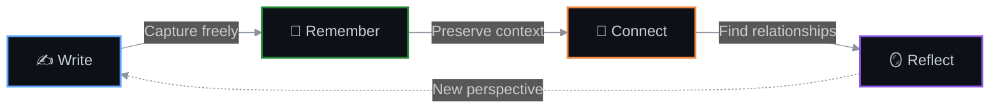

<div align="center">

<!-- ═══════════════════════════════════════════════════════════════ -->
<!--                         HERO SECTION                          -->
<!-- ═══════════════════════════════════════════════════════════════ -->


<br />

### ✦ Your thoughts, connected over time ✦

**An open-source AI-native journal for writing, remembering, connecting, and reflecting across your personal history.**

<br />

<!-- Animated typing subtitle -->


<br />

<!-- ═══════════════════════ BADGE ROW ═══════════════════════ -->

[](https://github.com/datascyther/Jouspace/stargazers)
[](https://github.com/datascyther/Jouspace/network/members)
[](https://github.com/datascyther/Jouspace/issues)
[](LICENSE)
[](https://www.typescriptlang.org/)
[](https://react.dev/)

<br />

<!-- Quick action buttons -->
<a href="https://github.com/datascyther/Jouspace/stargazers">
  
</a>
<a href="https://github.com/datascyther/Jouspace/fork">
  
</a>
<a href="https://github.com/datascyther/Jouspace/issues/new">
  
</a>

<br /><br />

<!-- ═══════════════════════ VISUAL DIVIDER ═══════════════════════ -->


</div>

<!-- ═══════════════════════════════════════════════════════════════ -->
<!--                    TABLE OF CONTENTS                          -->
<!-- ═══════════════════════════════════════════════════════════════ -->

<details open>
<summary><h2>📖 Table of Contents</h2></summary>

- [🌌 The Idea](#-the-idea)
- [🎯 Product Thesis](#-product-thesis)
- [🔄 The Core Loop](#-the-core-loop)
- [✨ What Makes Jouspace Different](#-what-makes-jouspace-different)
- [🧠 Intelligence Model](#-intelligence-model)
- [🎨 Core Experiences](#-core-experiences)
- [🏗️ System Architecture](#%EF%B8%8F-system-architecture)
- [🧩 Memory Architecture](#-memory-architecture)
- [⚡ Technology Stack](#-technology-stack)
- [🚀 Getting Started](#-getting-started)
- [📋 Available Scripts](#-available-scripts)
- [🗺️ Roadmap](#%EF%B8%8F-roadmap)
- [🤝 Contributing](#-contributing)
- [🔒 Security](#-security)
- [🧭 Responsible AI](#-responsible-ai)
- [📜 License](#-license)
- [🌟 Star History](#-star-history)

</details>

<div align="center">

</div>

<!-- ═══════════════════════════════════════════════════════════════ -->
<!--                      THE IDEA SECTION                         -->
<!-- ═══════════════════════════════════════════════════════════════ -->

## 🌌 The Idea

<div align="center">

> *"Most journals are good at storing thoughts. The problem is that stored thoughts eventually become an archive."*

</div>

Something you wrote three months ago may explain what you are thinking today, but conventional journaling software rarely understands that relationship.

AI chat has almost the opposite problem. It can be useful in the moment, yet without meaningful continuity, every conversation risks becoming another isolated interaction.

**Jouspace explores what happens when those two ideas are combined.**

It treats your writing, conversations, mood context, and reflections as parts of a growing personal history. Instead of making AI the center of the experience, Jouspace makes **your context** the center. The AI exists as a reflective layer over that context.

<div align="center">

| 📊 | 💡 |
|:---:|:---|
| **Conventional Journaling** | Entries become static archives |
| **AI Chat** | Conversations lack continuity |
| **Jouspace** | *Persistent context with reflective intelligence* |

</div>

<!-- ═══════════════════════════════════════════════════════════════ -->
<!--                   PRODUCT THESIS SECTION                      -->
<!-- ═══════════════════════════════════════════════════════════════ -->

## 🎯 Product Thesis

<div align="center">

### A personal space where writing, memory, mood, and AI context accumulate over time.

</div>

```
┌─────────────────────────────────────────────────────────────┐
│                                                             │
│   Personal software becomes more useful when it understands  │
│   continuity.                                                │
│                                                             │
│   ┌──────────────┐  ┌──────────────┐  ┌──────────────┐     │
│   │   Journal    │  │   Memory     │  │   Reflect    │     │
│   │   Entries    │  │   Layer      │  │   Surface    │     │
│   └──────┬───────┘  └──────┬───────┘  └──────┬───────┘     │
│          │                 │                 │              │
│          └─────────────────┼─────────────────┘              │
│                            ▼                                │
│                    ┌──────────────┐                         │
│                    │  YOUR CONTEXT │                        │
│                    └──────────────┘                         │
│                                                             │
└─────────────────────────────────────────────────────────────┘
```

A journal entry should not become irrelevant once it leaves the top of a timeline. A conversation should not automatically become disconnected from everything that came before it. A mood entry should provide context, not merely become another point on a chart.

**Jouspace is designed to make accumulated history useful again.**

<div align="center">

</div>

<!-- ═══════════════════════════════════════════════════════════════ -->
<!--                    CORE LOOP SECTION                          -->
<!-- ═══════════════════════════════════════════════════════════════ -->

## 🔄 The Core Loop

<div align="center">



</div>

### ✍️ Write
Capture thoughts freely. Jouspace is designed around **freeform writing first**. AI prompts and assistance should support the writing process rather than turn journaling into a questionnaire.

### 🧠 Remember
Preserve useful context across time. Entries, conversations, reflections, and supporting signals can contribute to a persistent personal context instead of existing as disconnected records.

### 🔗 Connect
Find relationships across your history. Past ideas, recurring themes, emotional context, and related moments can become discoverable when they matter again.

### 🪞 Reflect
Use AI to examine your own context. The goal is not to outsource thinking to an assistant. It is to create a system capable of helping you look back at your own history with more context.

<div align="center">

</div>

<!-- ═══════════════════════════════════════════════════════════════ -->
<!--              WHAT MAKES IT DIFFERENT SECTION                  -->
<!-- ═══════════════════════════════════════════════════════════════ -->

## ✨ What Makes Jouspace Different?

Jouspace is **not simply a journal with an AI chat box attached to it**. Its architecture is being developed around longitudinal context.

<div align="center">

<table>
<tr>
<td width="50%" valign="top">

#### ❌ Conventional Approach

- Entries become an archive
- AI reacts to the current prompt
- Mood is treated as the product
- Chat is the primary experience
- Memory means chat history
- AI constantly tries to engage
- Journaling is structured around prompts

</td>
<td width="50%" valign="top">

#### ✅ Jouspace Approach

- Entries contribute to persistent context
- AI can reason over relevant historical context
- Mood acts as supporting context
- AI exists across the broader product
- Memory represents useful personal context
- User agency remains central
- Freeform writing comes first

</td>
</tr>
</table>

</div>

> **The objective is not more AI. The objective is better continuity.**

<div align="center">

</div>

<!-- ═══════════════════════════════════════════════════════════════ -->
<!--                 INTELLIGENCE MODEL SECTION                    -->
<!-- ═══════════════════════════════════════════════════════════════ -->

## 🧠 Intelligence Model

<div align="center">

### 🪞 Mirror first · 🤝 Companion second · 📝 Scribe third

</div>

<div align="center">

| Priority | Role | Description |
|:---:|:---|:---|
| **1st** | 🪞 **Mirror** | The system should help surface patterns, connections, contradictions, and relevant pieces of your own history. |
| **2nd** | 🤝 **Companion** | Conversation remains important, but useful conversation should emerge from context rather than artificial personality alone. |
| **3rd** | 📝 **Scribe** | AI can assist with organization, recall, summarization, and reflection without replacing the user's own voice. |

</div>

<div align="center">

</div>

<!-- ═══════════════════════════════════════════════════════════════ -->
<!--                 CORE EXPERIENCES SECTION                      -->
<!-- ═══════════════════════════════════════════════════════════════ -->

## 🎨 Core Experiences

<div align="center">

<table>
<tr>
<td align="center" width="33%">

### 📓 Journal

A persistent writing space designed around freeform thought. Journal entries are not disposable documents — they become part of the historical context that can make future reflection more useful.

</td>
<td align="center" width="33%">

### 💬 AI Companion

A conversational interface connected to the broader Jouspace context. The companion is primarily user-initiated and designed to respond using relevant personal context when appropriate.

</td>
<td align="center" width="33%">

### 🧠 Memory

Jouspace explores persistent personal memory beyond ordinary conversation history. The goal is to retrieve **relevant context**, not dump an entire history into every model request.

</td>
</tr>
<tr>
<td align="center" width="33%">

### 🔗 Connections

As history grows, previously separate moments can become related. Connections may emerge across journal entries, conversations, recurring subjects, reflections, and contextual signals.

</td>
<td align="center" width="33%">

### 🎭 Mood Context

Mood remains part of Jouspace, but it does not define the product. Instead, mood acts as another contextual signal that can help make historical reflection more meaningful.

</td>
<td align="center" width="33%">

### 🪞 Reflection

Reflection sits above raw storage. Rather than merely showing what happened, Jouspace is designed to help users revisit their own history and understand how different moments may relate.

</td>
</tr>
</table>

</div>

<div align="center">

</div>

<!-- ═══════════════════════════════════════════════════════════════ -->
<!--               SYSTEM ARCHITECTURE SECTION                     -->
<!-- ═══════════════════════════════════════════════════════════════ -->

## 🏗️ System Architecture

Jouspace separates the product experience from the intelligence and persistence layers.

```mermaid
%%{init: {'theme': 'dark', 'themeVariables': { 'primaryColor': '#58a6ff', 'primaryTextColor': '#c9d1d9', 'primaryBorderColor': '#30363d', 'lineColor': '#8b949e', 'secondaryColor': '#161b22', 'tertiaryColor': '#21262d'}}}%%
flowchart TB

    subgraph Experience["🎨 Experience Layer"]
        direction TB
        JOURNAL["📓 Journal"]
        CHAT["💬 AI Companion"]
        MOOD["🎭 Mood Context"]
        REFLECTION["🪞 Reflection"]
    end

    subgraph Intelligence["🧠 Intelligence Layer"]
        direction TB
        RUNTIME["⚙️ AI Runtime"]
        CONTEXT["📦 Context Assembly"]
        RETRIEVAL["🔍 Context Retrieval"]
        MEMORY["🧬 Personal Memory"]
    end

    subgraph Data["💾 Data Layer"]
        direction TB
        SUPABASE["🗄️ Supabase"]
        PINECONE["📊 Pinecone"]
        STORAGE["📁 Persistent App Data"]
    end

    JOURNAL --> CONTEXT
    CHAT --> RUNTIME
    MOOD --> CONTEXT
    REFLECTION --> CONTEXT

    RUNTIME --> CONTEXT
    CONTEXT --> RETRIEVAL
    RETRIEVAL --> MEMORY

    MEMORY --> PINECONE
    CONTEXT --> SUPABASE
    JOURNAL --> STORAGE

    RETRIEVAL --> RUNTIME
    RUNTIME --> CHAT
    RUNTIME --> REFLECTION

    style Experience fill:#0d1117,stroke:#58a6ff,stroke-width:2px
    style Intelligence fill:#0d1117,stroke:#238636,stroke-width:2px
    style Data fill:#0d1117,stroke:#f0883e,stroke-width:2px
```

<div align="center">



</div>

> **The important distinction is that memory, retrieval, and generation are separate concerns.** This makes it possible to retrieve relevant context selectively instead of treating every previous interaction as permanent prompt baggage.

<div align="center">

</div>

<!-- ═══════════════════════════════════════════════════════════════ -->
<!--                MEMORY ARCHITECTURE SECTION                    -->
<!-- ═══════════════════════════════════════════════════════════════ -->

## 🧩 Memory Architecture

A useful personal AI system needs more than a long chat transcript. Conceptually, Jouspace treats memory as a pipeline:

```mermaid
%%{init: {'theme': 'dark', 'themeVariables': { 'primaryColor': '#58a6ff', 'primaryTextColor': '#c9d1d9', 'primaryBorderColor': '#30363d', 'lineColor': '#8b949e', 'secondaryColor': '#161b22', 'tertiaryColor': '#21262d'}}}%%
flowchart LR

    A["👤 User Activity"] -->|"Generate"| B["⚙️ Context Processing"]
    B -->|"Store"| C["💾 Persistent Data"]
    B -->|"Index"| D["🔍 Retrievable Memory"]

    C -->|"Assemble"| E["📦 Context Assembly"]
    D -->|"Search"| F["🎯 Semantic Retrieval"]

    E -->|"Feed"| G["🤖 AI Runtime"]
    F -->|"Feed"| G

    G -->|"Generate"| H["✨ Contextual Response / Reflection"]

    style A fill:#0d1117,stroke:#58a6ff,stroke-width:2px
    style B fill:#0d1117,stroke:#238636,stroke-width:2px
    style C fill:#0d1117,stroke:#f0883e,stroke-width:2px
    style D fill:#0d1117,stroke:#f0883e,stroke-width:2px
    style E fill:#0d1117,stroke:#8957e5,stroke-width:2px
    style F fill:#0d1117,stroke:#8957e5,stroke-width:2px
    style G fill:#0d1117,stroke:#58a6ff,stroke-width:3px
    style H fill:#0d1117,stroke:#238636,stroke-width:2px
```

<div align="center">



</div>

<div align="center">

> **The long-term objective is simple:** *Retrieve what matters when it matters.*
>
> Not every stored event deserves permanent attention.

</div>

<div align="center">

</div>

<!-- ═══════════════════════════════════════════════════════════════ -->
<!--                  TECHNOLOGY STACK SECTION                     -->
<!-- ═══════════════════════════════════════════════════════════════ -->

## ⚡ Technology Stack

Jouspace is being built as a full-stack AI product rather than a thin interface around a model API.

### 🖥️ Application

<div align="center">

| Technology | Purpose | Badge |
|:---|:---|:---|
| **React 19** | Primary web UI | [](https://react.dev/) |
| **React Native** | Cross-platform application architecture | [](https://reactnative.dev/) |
| **Expo** | Native application tooling | [](https://expo.dev/) |
| **TypeScript** | Type-safe application development | [](https://www.typescriptlang.org/) |
| **Vite** | Web development and production builds | [](https://vitejs.dev/) |
| **Tailwind CSS** | UI styling | [](https://tailwindcss.com/) |
| **Zustand** | Client state management | [](https://github.com/pmndrs/zustand) |
| **TanStack Query** | Asynchronous server-state management | [](https://tanstack.com/query) |

</div>

### 🧠 Data & Intelligence

<div align="center">

| Technology | Purpose | Badge |
|:---|:---|:---|
| **Supabase** | Application data and authentication | [](https://supabase.com/) |
| **Pinecone** | Vector retrieval and semantic memory | [](https://www.pinecone.io/) |
| **LLM Runtime** | Contextual AI generation and reflection | 🤖 Custom |
| **RAG** | Selective retrieval of relevant context | 🔍 Custom |

</div>

### 🔧 Engineering

<div align="center">

| Technology | Purpose | Badge |
|:---|:---|:---|
| **Vitest** | Testing framework | [](https://vitest.dev/) |
| **Zod** | Runtime validation | [](https://zod.dev/) |
| **GitHub** | Source control and collaboration | [](https://github.com/) |

</div>

<div align="center">

</div>

<!-- ═══════════════════════════════════════════════════════════════ -->
<!--                 GETTING STARTED SECTION                       -->
<!-- ═══════════════════════════════════════════════════════════════ -->

## 🚀 Getting Started

### ✅ Prerequisites

Before running Jouspace locally, ensure you have:

<div align="center">

| Requirement | Version | Verify Command |
|:---|:---:|:---|
| **Node.js** | `20+` | `node --version` |
| **npm** | `latest` | `npm --version` |
| **Git** | `latest` | `git --version` |

</div>

### 📦 Installation

<div align="center">

<table>
<tr>
<td width="60px" align="center"><h3>1️⃣</h3></td>
<td>

**Clone the repository**

```bash
git clone https://github.com/datascyther/Jouspace.git
cd Jouspace
```

</td>
</tr>
<tr>
<td width="60px" align="center"><h3>2️⃣</h3></td>
<td>

**Install dependencies**

```bash
npm install
```

</td>
</tr>
<tr>
<td width="60px" align="center"><h3>3️⃣</h3></td>
<td>

**Configure the environment**

Jouspace relies on external services for parts of its data and intelligence infrastructure.

Create your local environment configuration based on the environment templates and documentation available in the repository.

> ⚠️ **Never commit secrets or API keys to source control.**

</td>
</tr>
<tr>
<td width="60px" align="center"><h3>4️⃣</h3></td>
<td>

**Start the web application**

```bash
npm run dev
```

</td>
</tr>
<tr>
<td width="60px" align="center"><h3>5️⃣</h3></td>
<td>

**Create a production build**

```bash
npm run build
```

</td>
</tr>
<tr>
<td width="60px" align="center"><h3>6️⃣</h3></td>
<td>

**Preview the production build**

```bash
npm run preview
```

</td>
</tr>
</table>

</div>

<div align="center">

</div>

<!-- ═══════════════════════════════════════════════════════════════ -->
<!--                 AVAILABLE SCRIPTS SECTION                     -->
<!-- ═══════════════════════════════════════════════════════════════ -->

## 📋 Available Scripts

<div align="center">

| Command | Purpose | Environment |
|:---|:---|:---:|
| `npm run dev` | Start the Vite development server | 🌐 Web |
| `npm run build` | Create the production web build | 🌐 Web |
| `npm run preview` | Preview the production build | 🌐 Web |
| `npm run test` | Run the test suite | 🧪 Test |
| `npm run test:integration` | Run backend integration tests | 🧪 Test |
| `npm run dev:expo` | Start the Expo development environment | 📱 Mobile |
| `npm run android` | Run the Android application | 📱 Mobile |
| `npm run ios` | Run the iOS application | 📱 Mobile |
| `npm run web:expo` | Start the Expo web target | 📱 Mobile |
| `npm run rag:ingest` | Run the RAG ingestion workflow | 🤖 AI |
| `npm run pinecone:describe` | Inspect Pinecone configuration | 🤖 AI |
| `npm run pinecone:stats` | Inspect Pinecone index statistics | 🤖 AI |

</div>

<div align="center">

</div>

<!-- ═══════════════════════════════════════════════════════════════ -->
<!--                    ROADMAP SECTION                            -->
<!-- ═══════════════════════════════════════════════════════════════ -->

## 🗺️ Roadmap

Jouspace is being developed incrementally with an outcome-oriented approach.

### ✅ Completed

<div align="center">

| Milestone | Status |
|:---|:---:|
| Establish Jouspace product thesis | ✅ |
| Define journal-first product direction | ✅ |
| Build conversational AI foundation | ✅ |
| Build contextual retrieval infrastructure | ✅ |
| Establish persistent data infrastructure | ✅ |
| Implement mood history foundation | ✅ |

</div>

### 🚧 In Progress

<div align="center">

| Milestone | Status |
|:---|:---:|
| Complete Jouspace identity migration | 🚧 |
| Refine journal experience | 🚧 |
| Connect journal history to contextual memory | 🚧 |

</div>

### 📅 Upcoming

<div align="center">

| Milestone | Status |
|:---|:---:|
| Improve longitudinal retrieval | 📅 |
| Develop connection discovery | 📅 |
| Expand reflection experiences | 📅 |
| Strengthen privacy and data controls | 📅 |
| Expand automated evaluation and testing | 📅 |
| Mature cross-platform experience | 📅 |

</div>

> The roadmap is intentionally outcome-oriented. Features may change as the underlying product model is tested.

<div align="center">

</div>

<!-- ═══════════════════════════════════════════════════════════════ -->
<!--                  CONTRIBUTING SECTION                         -->
<!-- ═══════════════════════════════════════════════════════════════ -->

## 🤝 Contributing

Contributions, technical discussion, bug reports, and thoughtful product feedback are welcome.

### 🔄 Development Workflow

<div align="center">

```
┌─────────┐    ┌──────────┐    ┌────────┐    ┌──────┐    ┌─────────┐    ┌─────────┐
│   🍴    │───▶│   🌿     │───▶│  🛠️   │───▶│  🧪  │───▶│   🏗️    │───▶│   🚀    │
│   Fork  │    │  Branch  │    │ Change │    │ Test │    │  Build  │    │   PR    │
└─────────┘    └──────────┘    └────────┘    └──────┘    └─────────┘    └─────────┘
```

</div>

1. **Fork** the repository
2. **Create a branch:** `git checkout -b feature/your-feature`
3. **Make your changes**
4. **Run the relevant tests:** `npm run test`
5. **Verify the production build:** `npm run build`
6. **Commit** using a clear message: `git commit -m "feat: describe your change"`
7. **Push** your branch: `git push origin feature/your-feature`
8. **Open a Pull Request** explaining:
   - What changed
   - Why it changed
   - How it was tested
   - Any architectural implications

### 📋 Contribution Principles

<div align="center">

| Principle | Description |
|:---|:---|
| ✅ **Correctness** | Code should be correct and well-tested |
| 🔒 **Privacy** | Respect user data and privacy boundaries |
| 🧹 **Maintainability** | Write code that others can understand and maintain |
| ♿ **Accessibility** | Ensure the product is usable by everyone |
| 🛡️ **Type Safety** | Leverage TypeScript for runtime confidence |
| 🧪 **Testability** | Design for testing from the start |
| 🎯 **Clear Product Behavior** | Features should behave predictably |
| 🪶 **Minimal Complexity** | Avoid unnecessary complexity |

</div>

> For substantial architectural changes, opening an issue for discussion before implementation is recommended.

<div align="center">

</div>

<!-- ═══════════════════════════════════════════════════════════════ -->
<!--                    SECURITY SECTION                           -->
<!-- ═══════════════════════════════════════════════════════════════ -->

## 🔒 Security

- Do not report security vulnerabilities through public GitHub issues.
- Sensitive credentials, API keys, private user information, environment files, and production secrets must **never** be committed to the repository.
- When working with Jouspace's memory and context systems, assume that stored personal information may be sensitive and design accordingly.

<div align="center">

</div>

<!-- ═══════════════════════════════════════════════════════════════ -->
<!--                 RESPONSIBLE AI SECTION                        -->
<!-- ═══════════════════════════════════════════════════════════════ -->

## 🧭 Responsible AI

Jouspace deals with personal writing and contextual information, which creates responsibilities beyond ordinary application development.

<div align="center">

| Boundary | Commitment |
|:---|:---|
| 🎯 **Truth** | AI-generated output should not be presented as objective truth. |
| 📖 **Context** | Historical context can be incomplete or interpreted incorrectly. |
| 🏷️ **Attribution** | Retrieved memories should remain attributable to user context where practical. |
| 🎭 **Authenticity** | AI should avoid pretending to possess human memory or emotions. |
| 🎚️ **User Control** | User control should take priority over artificial engagement. |
| 🔐 **Selective Retrieval** | Sensitive personal context should be retrieved only when relevant. |
| 🔍 **Transparency** | The product should remain transparent about what AI can and cannot infer. |

</div>

> **The objective is not to create an artificial person. It is to build better software for working with personal context.**

<div align="center">

</div>

<!-- ═══════════════════════════════════════════════════════════════ -->
<!--               WHAT JOUSPACE IS NOT SECTION                    -->
<!-- ═══════════════════════════════════════════════════════════════ -->

## ⚠️ What Jouspace Is Not

<div align="center">

Jouspace is **not**:

🚫 a therapist &nbsp;&nbsp; 🚫 a medical device &nbsp;&nbsp; 🚫 a diagnostic system
🚫 a crisis intervention service &nbsp;&nbsp; 🚫 a replacement for professional healthcare
🚫 an autonomous decision-maker &nbsp;&nbsp; 🚫 a system intended to manufacture emotional dependency

</div>

Jouspace is an experimental open-source AI product focused on **journaling, personal context, memory, and reflection**.

<div align="center">

</div>

<!-- ═══════════════════════════════════════════════════════════════ -->
<!--                 PROJECT STATUS SECTION                        -->
<!-- ═══════════════════════════════════════════════════════════════ -->

## 📊 Project Status

> **Jouspace is under active development.**

The project is currently evolving from an earlier product direction into the Jouspace architecture and identity.

Core engineering work already exists across areas including:

<div align="center">

<table>
<tr>
<td align="center">💬 Conversational AI</td>
<td align="center">🔍 Contextual Retrieval</td>
<td align="center">🧠 Personal Memory</td>
<td align="center">📓 Journaling</td>
</tr>
<tr>
<td align="center">🎭 Mood History</td>
<td align="center">🔐 Authentication</td>
<td align="center">🏗️ Infrastructure</td>
<td align="center">📱 Cross-Platform UI</td>
</tr>
</table>

</div>

The current work focuses on integrating those systems around the new product thesis rather than rebuilding the application simply for the sake of a rebrand.

APIs, interfaces, architecture, and product behavior may change while the project matures.

<div align="center">

</div>

<!-- ═══════════════════════════════════════════════════════════════ -->
<!--                  STAR HISTORY SECTION                         -->
<!-- ═══════════════════════════════════════════════════════════════ -->

## 🌟 Star History

If Jouspace is useful to you, starring the repository helps other developers discover the project and gives us a pleasantly primitive but effective signal that someone on the internet cared.

<div align="center">

[](https://star-history.com/#datascyther/Jouspace&Date)

</div>

<!-- ═══════════════════════════════════════════════════════════════ -->
<!--                 REPOSITORY ACTIVITY SECTION                   -->
<!-- ═══════════════════════════════════════════════════════════════ -->

## 📈 Repository Activity

<div align="center">

[](https://github.com/datascyther/Jouspace/stargazers)
[](https://github.com/datascyther/Jouspace/network/members)
[](https://github.com/datascyther/Jouspace/issues)
[](https://github.com/datascyther/Jouspace/pulls)

</div>

<div align="center">

</div>

<!-- ═══════════════════════════════════════════════════════════════ -->
<!--                    LICENSE SECTION                            -->
<!-- ═══════════════════════════════════════════════════════════════ -->

## 📜 License

This project is licensed under the terms provided in the repository's [LICENSE](LICENSE) file.

Please review the license before redistributing, modifying, or incorporating Jouspace into another project.

<div align="center">

</div>

<!-- ═══════════════════════════════════════════════════════════════ -->
<!--                      FOOTER SECTION                           -->
<!-- ═══════════════════════════════════════════════════════════════ -->

<div align="center">


<br />

### Write → Remember → Connect → Reflect

**Your thoughts should become more useful with time, not disappear into an archive.**

<br />

[📁 Repository](https://github.com/datascyther/Jouspace)
·
[🐛 Issues](https://github.com/datascyther/Jouspace/issues)
·
[🔀 Pull Requests](https://github.com/datascyther/Jouspace/pulls)
·
[💬 Discussions](https://github.com/datascyther/Jouspace/discussions)

<br />

Built in public as an open-source exploration of AI, memory, personal context, and reflective software.

<br />

<!-- Footer badge -->


<br /><br />

<!-- Back to top link -->
<a href="#top">
  
</a>

</div>
