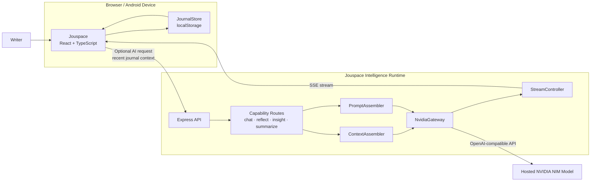
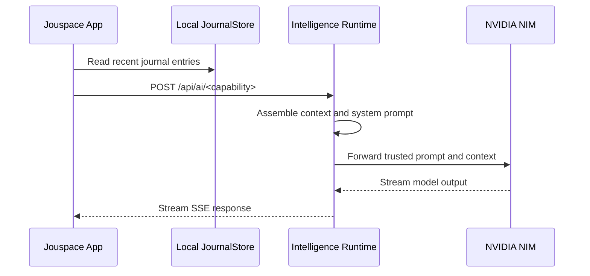

<a id="top"></a>

<div align="center">


<br />

**A calm, local-first journaling experience with thoughtful AI reflection.**

Built with **React**, powered by the **Jouspace Intelligence Runtime**, and available for **Web**, **PWA**, and **Android**.

<br />

[](./LICENSE)
[](https://github.com/datascyther/Jouspace/releases)
[](https://github.com/datascyther/Jouspace/actions/workflows/build-apk.yml)
[](https://react.dev/)
[](https://www.typescriptlang.org/)
[](https://vitejs.dev/)

<br />

[Repository](https://github.com/datascyther/Jouspace)
&nbsp;·&nbsp;
[Download APK](https://github.com/datascyther/Jouspace/releases)
&nbsp;·&nbsp;
[Live AI Runtime](https://jouspace-runtime.jouspace.workers.dev)
&nbsp;·&nbsp;
[Deployment Guide](./DEPLOYMENT.md)

<br />

</div>

---

<div align="center">

### Quiet writing. Private reflection. Intentional AI.

```text
Your journal should feel personal, calm, and yours.
```

</div>

---

## Overview

**Jouspace** is a private journaling app designed around calm writing, personal ownership, and optional AI-assisted reflection.

The journal is **local-first**: entries remain on the device by default. When AI is enabled, Jouspace sends only the relevant context for the selected request to a configured **Jouspace Intelligence Runtime**, which streams the response back to the app.

> [!IMPORTANT]
> Jouspace offers an **on-device-feeling AI experience**, but model inference is performed by the configured remote runtime and its hosted NVIDIA NIM model. AI features are optional.

---

## Highlights

<table>
<tr>
<td width="50%" valign="top">

### Local-first journaling

Journal entries are stored in the browser or Android WebView using `localStorage`.

The core writing experience works without an account, database, telemetry, or cloud sync.

</td>
<td width="50%" valign="top">

### Streaming AI reflection

AI chat, reflections, insights, and summaries stream back through **Server-Sent Events** for a responsive, conversational experience.

</td>
</tr>
<tr>
<td width="50%" valign="top">

### Web, PWA, and Android

The same React application runs in the browser, installs as a PWA, and ships inside a committed Capacitor Android shell.

</td>
<td width="50%" valign="top">

### Portable by design

Export and import journal data as JSON. The storage layer is isolated behind `JournalStore` for future cloud-sync support.

</td>
</tr>
<tr>
<td width="50%" valign="top">

### Stateless AI runtime

The runtime does not store journals. The frontend sends recent entries with each AI request, and the server falls back to seed data only when no entries are provided.

</td>
<td width="50%" valign="top">

### Production-ready APK pipeline

GitHub Actions can build a signed Android release APK using the committed Capacitor platform and release-signing configuration.

</td>
</tr>
</table>

---

## Project links

| Resource | Address |
| --- | --- |
| **Source repository** | [github.com/datascyther/Jouspace](https://github.com/datascyther/Jouspace) |
| **Live AI Runtime** | [jouspace-runtime.jouspace.workers.dev](https://jouspace-runtime.jouspace.workers.dev) |
| **Releases and APKs** | [github.com/datascyther/Jouspace/releases](https://github.com/datascyther/Jouspace/releases) |
| **Deployment guide** | [`DEPLOYMENT.md`](./DEPLOYMENT.md) |

---

## Technology stack

| Layer | Technology |
| --- | --- |
| **Frontend** | React 19, TypeScript, Vite 7, Tailwind CSS 4 |
| **Build pipeline** | `vite-plugin-singlefile` — app JavaScript and CSS inline into one `dist/index.html` |
| **PWA** | Manifest, icons, and self-hosted offline-safe fonts in `public/` |
| **Persistence** | Local-first journal storage through `localStorage` |
| **AI Runtime** | Express 4, OpenAI SDK, NVIDIA NIM gateway, SSE streaming |
| **Runtime hosting** | Cloudflare Workers |
| **Authentication** | Optional Firebase Authentication integration |
| **Mobile shell** | Capacitor with committed `android/` platform, branded icons, native permissions, and release signing |

---

## Table of contents

| Section | Description |
| --- | --- |
| [Quick start](#quick-start) | Install dependencies and run the full development environment |
| [Architecture](#architecture) | Frontend, runtime, storage, and AI flow |
| [AI capabilities](#ai-capabilities) | Chat, reflection, insight, and summary endpoints |
| [Runtime configuration](#runtime-configuration) | Development proxy, production runtime URL, and CORS |
| [Building the Android APK](#building-the-android-apk) | GitHub Actions and local Android release builds |
| [Versioning](#versioning) | Semantic versioning and Android version codes |
| [Production and deployment](#production-and-deployment) | Cloudflare Workers, data model, and Firebase Auth |
| [Available scripts](#available-scripts) | Project commands |
| [Security](#security) | Runtime isolation and safe AI handling |
| [Privacy](#privacy) | Local-first behavior and AI opt-in model |
| [License](#license) | MIT License |

---

<a id="quick-start"></a>

## Quick start

### 1. Clone the repository

```bash
git clone https://github.com/datascyther/Jouspace.git
cd Jouspace
```

### 2. Install dependencies

```bash
# Frontend dependencies
npm install

# Intelligence Runtime dependencies
cd server
npm install
cd ..
```

### 3. Configure the runtime

Create `server/.env`:

```dotenv
NVIDIA_API_KEY=your_nvidia_nim_key
```

> [!CAUTION]
> `server/.env` is gitignored and must never be committed.

### 4. Start the full development environment

```bash
npm run dev:all
```

| Service | Local address |
| --- | --- |
| **Jouspace frontend** | `http://localhost:5173` |
| **Intelligence Runtime** | `http://localhost:3001` |

During development, the frontend calls `/api/ai/*` on its own origin. Vite proxies those requests to the local runtime on port `3001`.

---

<a id="architecture"></a>

## Architecture



### Frontend responsibilities

```text
React application
├── AI chat
├── Reflection drawer
├── Insight cards
├── Writing summaries
├── Local JournalStore
└── useJouspaceIntelligence(capability)
      └── POST {runtime}/api/ai/<capability>
```

The frontend:

- Stores journal entries locally.
- Selects recent entries as context for AI requests.
- Connects to the runtime through a configurable base URL.
- Consumes AI output as an SSE stream.
- Keeps AI functionality optional and separate from the core journal.

### Runtime responsibilities

```text
server/
├── routes/
│   └── chat · reflect · insight · summarize
├── ContextAssembler
│   └── Assembles journal context from client-supplied entries
├── PromptAssembler
│   └── Creates Jouspace-branded system prompts per capability
├── gateway/
│   └── NvidiaGateway
└── StreamController
    └── Converts AsyncIterable output into SSE responses
```

The runtime is intentionally **stateless**. It does not require a journal database and falls back to seed data only when the client provides no entries.

---

<a id="ai-capabilities"></a>

## AI capabilities

Each AI capability is exposed through:

```text
POST /api/ai/<capability>
```

| Capability | Purpose | Output |
| --- | --- | --- |
| `chat` | Conversational exploration of thoughts and journal context | SSE stream |
| `reflect` | Calm reflection on a journal entry or recent writing | SSE stream |
| `insight` | Extraction of themes, patterns, and useful observations | SSE stream |
| `summarize` | Concise summaries of recent journal activity | SSE stream |

### AI request lifecycle



---

<a id="runtime-configuration"></a>

## Runtime configuration

### Development

No frontend runtime URL is required during local development:

```text
Frontend /api/ai/*  →  Vite proxy  →  localhost:3001
```

### Deployed PWA or Android APK

Set `VITE_API_BASE_URL` when creating a production build:

```bash
VITE_API_BASE_URL=https://your-runtime-host.example npm run build
```

For the hosted Jouspace runtime:

```bash
VITE_API_BASE_URL=https://jouspace-runtime.jouspace.workers.dev npm run build
```

> [!NOTE]
> A build does not have to use the public runtime. Jouspace can ship without a default runtime and let users configure one from Profile.

### CORS

The runtime already permits the standard Capacitor WebView origins:

```text
capacitor://localhost
https://localhost
```

Add other permitted origins through the `CORS_ORIGINS` environment variable:

```dotenv
CORS_ORIGINS=https://journal.example.com,https://preview.example.com
```

---

<a id="building-the-android-apk"></a>

## Building the Android APK

The `android/` platform is committed to the repository and includes:

- Branded application icons
- Native permissions
- Capacitor configuration
- Permanent release-signing configuration
- Reproducible Gradle release pipeline

The web application builds into `dist/`, with app JavaScript and CSS inlined into a single `dist/index.html`. Capacitor then synchronizes that build into the native Android shell.

---

### Option A — GitHub Actions

**Recommended: no local Android setup required.**

1. Push this repository to GitHub.
2. Open **Actions**.
3. Select **Build Android APK**.
4. Choose **Run workflow**.
5. Download `jouspace-release.apk` from the run's **Artifacts** section.

Workflow file:

```text
.github/workflows/build-apk.yml
```

Release pipeline:

```text
Install dependencies
      ↓
Build the web application
      ↓
Run npx cap sync android
      ↓
Stamp the Android version
      ↓
Build a signed release APK
      ↓
Upload jouspace-release.apk
```

Version metadata is derived from the Git tag:

```text
v1.1.0-beta.1
├── versionName: 1.1.0-beta.1
└── versionCode: 11001
```

---

### Option B — Local build

Local Android builds require:

- JDK 17
- Android SDK
- Configured Android build environment

```bash
npm run build
npx cap sync android

cd android
./gradlew assembleRelease
```

The generated APK is written to:

```text
android/app/build/outputs/apk/release/app-release.apk
```

> [!WARNING]
> Preserve the release keystore and its credentials. Losing the signing identity prevents future APKs from being published as updates to the same Android application.

---

<a id="versioning"></a>

## Versioning

Jouspace follows **Semantic Versioning** and uses `-beta.N` for prerelease builds.

| Git tag | Android `versionName` | Android `versionCode` |
| --- | ---: | ---: |
| `v1.1.0-beta.1` | `1.1.0-beta.1` | `11001` |
| `v1.1.0-beta.2` | `1.1.0-beta.2` | `11002` |
| `v1.1.0` | `1.1.0` | `11100` |

### Version code formula

```text
versionCode =
  MAJOR × 10000
  + MINOR × 1000
  + PATCH × 100
  + iteration
```

Where `iteration` is:

| Release type | Iteration value |
| --- | --- |
| Beta release `-beta.N` | `01`–`99` |
| Stable release | `100` |

This keeps `versionCode` strictly increasing so Android and Google Play always order newer builds correctly.

### Release rules

1. Increment the beta number for every prerelease:

   ```text
   1.1.0-beta.1 → 1.1.0-beta.2 → 1.1.0-beta.3
   ```

2. Drop the beta suffix when promoting to stable:

   ```text
   1.1.0-beta.3 → 1.1.0
   ```

3. Keep `package.json` `version` synchronized with the Android `versionName`.

4. Trigger a release build by pushing a matching Git tag:

   ```bash
   git tag v1.1.0-beta.1
   git push origin v1.1.0-beta.1
   ```

5. Or use the workflow's manual `version` input from the GitHub Actions interface.

See [`DEPLOYMENT.md` §2.2](./DEPLOYMENT.md) for the complete release scheme.

---

<a id="production-and-deployment"></a>

## Production and deployment

### Runtime deployment

Deploy the Jouspace Intelligence Runtime to **Cloudflare Workers** by following:

- [`DEPLOYMENT.md`](./DEPLOYMENT.md)

Then compile the client against the deployed runtime:

```bash
VITE_API_BASE_URL=https://jouspace-runtime.<subdomain>.workers.dev npm run build
```

The runtime is deliberately stateless:

- No journal database is required.
- Journal context is supplied by the client with each AI request.
- Seed context is used only when the client sends no entries.
- AI provider credentials remain on the server.

### Local-first data model

The frontend persists journal entries through the store implementation in:

```text
src/store/
```

Recent entries are attached to AI requests as contextual input.

A future cloud-sync layer can be introduced behind the `JournalStore` interface without replacing the AI pipeline or journal UI.

### Optional authentication

Firebase Authentication support is wired for:

- Google sign-in
- Email/password authentication

Authentication is an optional identity layer. The local journal remains usable without an account.

Configure Firebase web credentials in the frontend `.env` file:

```dotenv
VITE_FIREBASE_API_KEY=...
VITE_FIREBASE_AUTH_DOMAIN=...
VITE_FIREBASE_PROJECT_ID=...
VITE_FIREBASE_STORAGE_BUCKET=...
VITE_FIREBASE_MESSAGING_SENDER_ID=...
VITE_FIREBASE_APP_ID=...
```

For Android Google sign-in, provide:

```text
android/app/google-services.json
```

Profile metadata such as display name and join date is stored locally. See [`DEPLOYMENT.md` §3](./DEPLOYMENT.md) for configuration details and the current authentication status.

---

<a id="available-scripts"></a>

## Available scripts

| Command | Description |
| --- | --- |
| `npm run dev` | Start the Vite development server |
| `npm run build` | Create the production frontend build in `dist/` |
| `npm run server` | Start the Intelligence Runtime with `tsx` watch mode |
| `npm run dev:all` | Run the frontend and Intelligence Runtime together |

### Common workflows

```bash
# Frontend only
npm run dev
```

```bash
# Runtime only
npm run server
```

```bash
# Full local development environment
npm run dev:all
```

```bash
# Production web build
npm run build
```

---

<a id="security"></a>

## Security

Jouspace separates trusted runtime behavior from untrusted client input.

### API key isolation

The NVIDIA API key exists only in the runtime environment:

```text
server/.env
```

It is never embedded in the frontend bundle or sent to the client.

### System prompt protection

Client-supplied messages with the `system` role are rejected or ignored. The runtime injects its own capability-specific system prompt through `PromptAssembler`.

### Reasoning privacy

Model `reasoning_content` is consumed and discarded by the runtime. Chain-of-thought output is never forwarded through the SSE stream.

### Safe error responses

The global error handler returns a generic response:

```json
{
  "error": "Intelligence unavailable"
}
```

Stack traces and internal runtime details are not exposed to the client.

### Stateless request handling

The runtime does not require persistent journal storage. Context is assembled from entries included with the current request.

---

<a id="privacy"></a>

## Privacy

Jouspace is designed as a **local-first journal**.

### What remains on the device

By default, journal entries are stored in the browser's `localStorage` or in the Android app's WebView storage.

The core journaling experience does not require:

- A Jouspace account
- A cloud journal database
- Analytics
- Telemetry
- Remote entry logging
- AI access

### When AI is enabled

AI features are opt-in. When a runtime is configured and an AI action is requested:

1. The client selects relevant journal context.
2. That context is sent to the configured runtime.
3. The runtime sends the prompt to its configured model provider.
4. The generated response is streamed back to the app.

Choose a runtime and model provider you trust. Their infrastructure and privacy terms apply to the content intentionally submitted for AI processing.

> [!IMPORTANT]
> A default build may ship without a runtime configured. In that case, the AI interface remains inactive until a runtime URL is added in Profile.

### Export and import

Profile includes JSON export and import so journal data remains portable and under the user's control.

### Device-local data risk

Because journal data is stored locally, the following actions may permanently erase it:

- Uninstalling the application
- Clearing browser or WebView storage
- Resetting the device
- Removing application data

Export your journal regularly and keep backups in a secure location.

---

<a id="license"></a>

## License

Jouspace is released under the [MIT License](./LICENSE).

```text
Copyright © Jouspace contributors
SPDX-License-Identifier: MIT
```

---

<div align="center">


**Built for quieter thoughts, private writing, and more intentional reflection.**

<br />

[Back to top ↑](#top)

</div>
