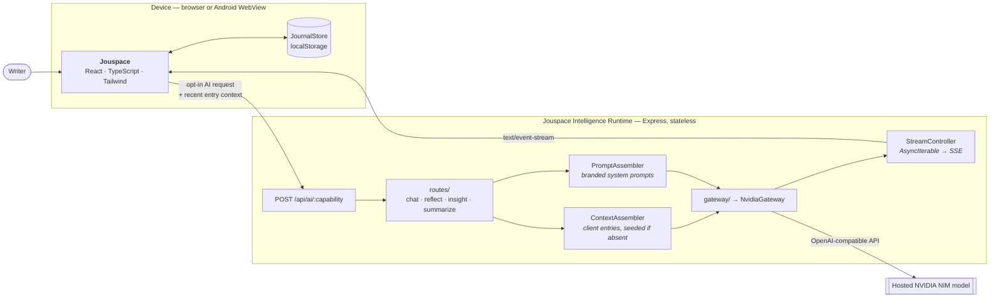
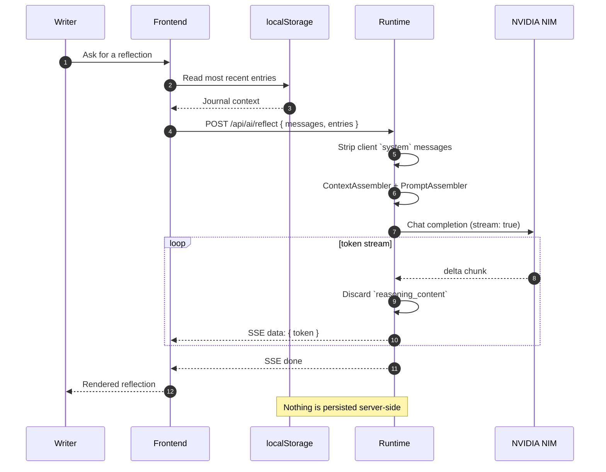

<a id="top"></a>

<div align="center">

<!-- ╔══════════════════════════════════════════════════════════════╗ -->
<!-- ║                          H E R O                             ║ -->
<!-- ╚══════════════════════════════════════════════════════════════╝ -->

<h1>
  <br />
  Jouspace
</h1>

<h3>AI-Native Private Journal</h3>

<p>
  <em>A calm place to write.</em><br />
  Local-first storage · opt-in AI reflection · Web, PWA, and Android.
</p>

<br />

<p>
  <a href="https://github.com/datascyther/Jouspace/releases">
    
  </a>
  <a href="https://github.com/datascyther/Jouspace/actions/workflows/build-apk.yml">
    
  </a>
  <a href="./LICENSE">
    
  </a>
</p>

<p>
  
  
  
  
  
  
  
  
</p>

<br />

<p>
  <a href="#-quick-start"><b>Quick start</b></a>
  &nbsp;&nbsp;·&nbsp;&nbsp;
  <a href="#-architecture"><b>Architecture</b></a>
  &nbsp;&nbsp;·&nbsp;&nbsp;
  <a href="#-building-the-android-apk"><b>Android build</b></a>
  &nbsp;&nbsp;·&nbsp;&nbsp;
  <a href="#-privacy"><b>Privacy</b></a>
  &nbsp;&nbsp;·&nbsp;&nbsp;
  <a href="./DEPLOYMENT.md"><b>Deployment</b></a>
</p>

<br />

</div>

---

<div align="center">

> ### “Your journal should feel personal, quiet, and yours.”
>
> Entries stay on your device by default.
> Nothing is sent anywhere until **you** ask the AI a question.

</div>

---

## ◆ At a glance

<table>
<tr>
<td><b>What it is</b></td>
<td>A private journaling app with an optional AI reflection layer</td>
</tr>
<tr>
<td><b>Where data lives</b></td>
<td><code>localStorage</code> on your device — no account, no cloud journal DB</td>
</tr>
<tr>
<td><b>How AI works</b></td>
<td>Client sends recent entries → <b>Jouspace Intelligence Runtime</b> → hosted <b>NVIDIA NIM</b> → SSE stream back</td>
</tr>
<tr>
<td><b>Ships as</b></td>
<td>Browser app · installable PWA · signed Android APK</td>
</tr>
<tr>
<td><b>Backend shape</b></td>
<td>Stateless Express server — <b>no database required</b></td>
</tr>
</table>

> [!IMPORTANT]
> Jouspace is designed to *feel* on-device, but inference runs on the configured
> remote runtime and its hosted model. **AI is entirely optional** — the journal
> works fully without it.

---

## ◆ Why Jouspace

<table>
<tr>
<td width="33%" valign="top">

### ▸ Private by default

Entries persist in browser / WebView
`localStorage`. No account, no sync
server, nothing to breach.

</td>
<td width="33%" valign="top">

### ▸ AI on your terms

The AI tab is inert until you point it
at a runtime you trust. Opt-in, per
request, never in the background.

</td>
<td width="33%" valign="top">

### ▸ Streaming reflection

Chat, reflect, insight, and summarize
all arrive as **Server-Sent Events**
for a live, conversational feel.

</td>
</tr>
<tr>
<td valign="top">

### ▸ One file, everywhere

`vite-plugin-singlefile` inlines the
entire app into one `dist/index.html`
— trivially portable and offline-safe.

</td>
<td valign="top">

### ▸ Android, pre-wired

A committed Capacitor `android/`
platform with branded icons, native
permissions, and release signing.

</td>
<td valign="top">

### ▸ Portable by design

JSON export/import in Profile, and a
`JournalStore` seam ready for a future
cloud sync without touching the AI path.

</td>
</tr>
</table>

---

## ◆ Project addresses

| Resource | Address |
| :--- | :--- |
| **Repository** | https://github.com/datascyther/Jouspace |
| **Live AI Runtime** (Cloudflare Workers) | https://jouspace-runtime.jouspace.workers.dev |
| **Releases / APK downloads** | https://github.com/datascyther/Jouspace/releases |
| **Deployment guide** | [`DEPLOYMENT.md`](./DEPLOYMENT.md) |

---

## ◆ Stack

| Layer | Technology |
| :--- | :--- |
| **Frontend** | React 19 · TypeScript · Vite 7 · Tailwind CSS 4 |
| **Build** | `vite-plugin-singlefile` — the whole app inlines into one `dist/index.html` |
| **PWA** | Manifest + icons + self-hosted fonts in `public/` (offline-safe) |
| **AI Runtime** | Express 4 + OpenAI SDK (NVIDIA NIM gateway), SSE streaming |
| **Runtime hosting** | Cloudflare Workers |
| **Mobile shell** | Capacitor — committed `android/` platform with branded icons, native permissions, and release signing |
| **Auth** *(optional)* | Firebase Auth — Google + email/password, identity only |
| **Storage** | Local-first journal persistence via `localStorage` (`src/store/`) |

---

## ◆ Contents

<table>
<tr>
<td valign="top" width="50%">

1. [Quick start](#-quick-start)
2. [Architecture](#-architecture)
3. [AI capabilities](#-ai-capabilities)
4. [Runtime endpoint configuration](#-runtime-endpoint-configuration)
5. [Building the Android APK](#-building-the-android-apk)

</td>
<td valign="top" width="50%">

6. [Versioning](#-versioning)
7. [Production notes](#-production-notes)
8. [Scripts](#-scripts)
9. [Security notes](#-security-notes)
10. [Privacy](#-privacy) · [License](#-license)

</td>
</tr>
</table>

---

## ◆ Quick start

<blockquote>
<b>Prerequisites</b> — Node.js 20+ · npm · <i>(Android only)</i> JDK 17 + Android SDK
</blockquote>

### ➊ Clone

```bash
git clone https://github.com/datascyther/Jouspace.git
cd Jouspace
```

### ➋ Install

```bash
npm install            # frontend dependencies
cd server && npm i     # Intelligence Runtime dependencies
cd ..
```

### ➌ Configure the runtime

Create `server/.env` — it is **gitignored** and must never be committed:

```dotenv
NVIDIA_API_KEY=your_nvidia_nim_key
```

> [!CAUTION]
> This key grants access to your model provider account. Keep it server-side only.
> It is never bundled into the frontend and never reaches the client.

### ➍ Run everything

```bash
npm run dev:all        # Vite + Runtime, together
```

| Service | Address |
| :--- | :--- |
| Jouspace frontend | http://localhost:5173 |
| Intelligence Runtime | http://localhost:3001 |

In development the frontend calls its **own origin** (`/api/ai/*`) and Vite
proxies those requests to `localhost:3001` — no CORS, no env var needed.

---

## ◆ Architecture



<details>
<summary><b>Sequence — what one AI request actually does</b></summary>

<br />



</details>

### ▸ Frontend

```text
Frontend (React)
  ├── useJouspaceIntelligence(capability)  → POST {runtime}/api/ai/<capability>
  ├── AI chat, reflection drawer, insight cards, writing summary
  ├── JournalStore (localStorage, src/store/)
  └── API base URL is configurable (VITE_API_BASE_URL)
```

The frontend stores entries locally, selects recent ones as request context,
consumes AI output as an SSE stream, and keeps the AI layer strictly optional
and decoupled from the journal itself.

### ▸ Intelligence Runtime

```text
Intelligence Runtime (Express, server/)
  ├── routes/*          chat · reflect · insight · summarize (all SSE streaming)
  ├── ContextAssembler  journal context from client-sent entries (seeded if absent)
  ├── PromptAssembler   Jouspace-branded system prompts per capability
  ├── gateway/*         provider abstraction (NvidiaGateway = live implementation)
  └── StreamController  AsyncIterable → SSE to the client
```

The runtime is intentionally **stateless** — no database, no journal storage.
It falls back to seed data only when the client sends no entries.

---

## ◆ AI capabilities

Every capability lives behind one predictable shape:

```http
POST /api/ai/<capability>
Content-Type: application/json
Accept: text/event-stream
```

| Capability | Purpose | Transport |
| :--- | :--- | :--- |
| `chat` | Conversational exploration of thoughts and journal context | SSE |
| `reflect` | Calm reflection on an entry or recent writing | SSE |
| `insight` | Themes, patterns, and useful observations | SSE |
| `summarize` | Concise summary of recent journal activity | SSE |

---

## ◆ Runtime endpoint configuration

### ▸ Development

```text
Frontend  /api/ai/*   →   Vite proxy   →   localhost:3001
```

No environment variable required.

### ▸ Deployed PWA or APK

Point the build at a real backend:

```bash
VITE_API_BASE_URL=https://your-runtime-host npm run build
```

Using the hosted Jouspace runtime:

```bash
VITE_API_BASE_URL=https://jouspace-runtime.jouspace.workers.dev npm run build
```

> [!NOTE]
> A build does not have to embed a runtime. Shipping **without** a default
> runtime leaves AI inert until the user configures a URL in Profile — which is
> exactly how the privacy-preserving default build behaves.

### ▸ CORS

Already allowed out of the box (Android WebView origins):

```text
capacitor://localhost
https://localhost
```

Add anything else via the server-side `CORS_ORIGINS` env var:

```dotenv
CORS_ORIGINS=https://journal.example.com,https://preview.example.com
```

---

## ◆ Building the Android APK

The `android/` platform is **committed** to the repo, complete with:

`branded icons` · `native permissions` · `Capacitor config` · `permanent release signing` · `Gradle release pipeline`

The web app compiles to a single `dist/index.html`, which Capacitor syncs into
the committed native shell.

<table>
<tr>
<th width="50%">Option A — GitHub Actions</th>
<th width="50%">Option B — Local build</th>
</tr>
<tr>
<td valign="top">

**Recommended · zero local setup**

1. Push this repo to GitHub
2. **Actions** → **Build Android APK**
3. **Run workflow**
4. Download `jouspace-release.apk` from **Artifacts**

</td>
<td valign="top">

**Requires JDK 17 + Android SDK**

```bash
npm run build
npx cap sync android
cd android && ./gradlew assembleRelease
```

Output:
`android/app/build/outputs/apk/release/app-release.apk`

</td>
</tr>
</table>

### ▸ What the workflow does

Defined at `.github/workflows/build-apk.yml`:

```text
install deps  →  build web app  →  npx cap sync android
              →  stamp version from git tag
              →  assembleRelease (signed, committed keystore)
              →  upload jouspace-release.apk
```

Version metadata is derived from the git tag:

```text
v1.1.0-beta.1
 ├── versionName  1.1.0-beta.1
 └── versionCode  11001
```

> [!WARNING]
> Preserve the release keystore and its credentials. Losing the signing identity
> makes it impossible to ship updates to the same Android application ID.

---

## ◆ Versioning

Jouspace follows **Semantic Versioning** with a `-beta.N` pre-release tag.

| Git tag | `versionName` | `versionCode` |
| :--- | :--- | ---: |
| `v1.1.0-beta.1` | `1.1.0-beta.1` | `11001` |
| `v1.1.0-beta.2` | `1.1.0-beta.2` | `11002` |
| `v1.1.0` *(stable)* | `1.1.0` | `11100` |

### ▸ The formula

```text
versionCode = MAJOR·10000 + MINOR·1000 + PATCH·100 + iteration
```

| Release type | `iteration` |
| :--- | :--- |
| Beta `-beta.N` | the beta number, `01`–`99` |
| Stable | `100` |

This keeps `versionCode` **strictly increasing on every release**, so
Android/Play always orders a newer build above an older one — and any stable
release outranks every beta of the same version.

### ▸ Release rules

1. **Bump the beta number** each iteration — `1.1.0-beta.1` → `-beta.2` → …
2. **Drop the suffix** when promoting to stable — `1.1.0-beta.3` → `1.1.0`
3. **Keep `package.json`'s `version` in sync** with the current versionName
4. **Trigger a build** by pushing a matching tag (the workflow's `v*` filter):

   ```bash
   git tag v1.1.0-beta.1
   git push origin v1.1.0-beta.1
   ```

5. Or use the Actions UI → **Build Android APK** → manual `version` input

Full scheme: [`DEPLOYMENT.md` §2.2](./DEPLOYMENT.md).

---

## ◆ Production notes

<details open>
<summary><b>Deployment</b></summary>

<br />

See [`DEPLOYMENT.md`](./DEPLOYMENT.md) for step-by-step hosting on Cloudflare
Workers, runtime env vars, APK release signing (keystore → `assembleRelease`),
and the current auth status.

</details>

<details>
<summary><b>Backend</b></summary>

<br />

Deploy the runtime to **Cloudflare Workers**, then build the client against it:

```bash
VITE_API_BASE_URL=https://jouspace-runtime.<subdomain>.workers.dev npm run build
```

The runtime is intentionally simple and **stateless**:

- No database required
- Journal context arrives with each request
- Seed data is used only when the client sends none
- Provider credentials never leave the server

</details>

<details>
<summary><b>Data — local-first hybrid</b></summary>

<br />

The frontend persists journal entries in `localStorage` (`src/store/`) and sends
the most recent ones to the runtime with every AI request. A future cloud sync
can be added **behind the `JournalStore` interface** without touching the AI
pipeline or the journal UI.

</details>

<details>
<summary><b>Auth — Firebase, identity only</b></summary>

<br />

Google sign-in and email/password both go through **Firebase Auth**. Profile
data (display name, join date) is stored locally in `localStorage`.

Frontend `.env`:

```dotenv
VITE_FIREBASE_API_KEY=…
VITE_FIREBASE_AUTH_DOMAIN=…
VITE_FIREBASE_PROJECT_ID=…
VITE_FIREBASE_STORAGE_BUCKET=…
VITE_FIREBASE_MESSAGING_SENDER_ID=…
VITE_FIREBASE_APP_ID=…
```

For Android, add `android/app/google-services.json`.
See [`DEPLOYMENT.md` §3](./DEPLOYMENT.md).

</details>

---

## ◆ Scripts

| Command | What it does |
| :--- | :--- |
| `npm run dev` | Vite dev server (frontend only) |
| `npm run build` | Production build → `dist/` (single file + public assets) |
| `npm run server` | Intelligence Runtime (`server/`, tsx watch) |
| `npm run dev:all` | Frontend + Runtime together |

---

## ◆ Security notes

<table>
<tr>
<td width="34%"><b>◇ Key isolation</b></td>
<td>The model API key lives only in <code>server/</code> (via gitignored <code>.env</code>) and never reaches the client.</td>
</tr>
<tr>
<td><b>◇ Prompt integrity</b></td>
<td>The runtime blocks client-supplied <code>system</code> role messages and injects its own capability-specific system prompt.</td>
</tr>
<tr>
<td><b>◇ Reasoning privacy</b></td>
<td>Model chain-of-thought (<code>reasoning_content</code>) is consumed and discarded — it never appears in the SSE output.</td>
</tr>
<tr>
<td><b>◇ Opaque errors</b></td>
<td>The global error handler returns generic <code>{ "error": "Intelligence unavailable" }</code>; stack traces never leave the server.</td>
</tr>
<tr>
<td><b>◇ Stateless surface</b></td>
<td>No journal persistence server-side. Context is assembled from the current request only.</td>
</tr>
</table>

---

## ◆ Privacy

Jouspace v1 is **local-first and account-free**. Your journal is stored entirely
on your device — in the browser's `localStorage`, inside the app's WebView.
There is no account, no cloud sync, and no server that can read your journal.

| | |
| :--- | :--- |
| **No telemetry** | No analytics, no remote logging of your entries |
| **AI is opt-in** | The AI tab does nothing until you set a runtime URL in Profile. The default build has **no runtime configured**. |
| **You choose the runtime** | Entries you send go to *that* runtime to generate reflections — pick one you trust |
| **Export / import** | JSON, from Profile, so your data stays yours |

> [!IMPORTANT]
> **Loss risk.** Because data is device-local, uninstalling the app or clearing
> site data **erases your journal**. Export regularly and keep a backup.

<details>
<summary><b>What happens when you do use AI</b></summary>

<br />

```text
1 · The client selects relevant journal context
2 · That context is sent to the runtime you configured
3 · The runtime prompts its configured model provider
4 · The response is streamed back and rendered
5 · Nothing is stored server-side
```

The infrastructure and privacy terms of your chosen runtime and model provider
apply to content you intentionally submit for AI processing.

</details>

---

## ◆ License

Released under the [MIT License](./LICENSE).

```text
Copyright © Jouspace contributors
SPDX-License-Identifier: MIT
```

---

<div align="center">

<br />

**Jouspace**

*Built for quieter thoughts, private writing, and more intentional reflection.*

<br />

<sub>
  <a href="https://github.com/datascyther/Jouspace">Repository</a> ·
  <a href="https://github.com/datascyther/Jouspace/releases">Releases</a> ·
  <a href="./DEPLOYMENT.md">Deployment</a> ·
  <a href="#top">Back to top ↑</a>
</sub>

<br /><br />

</div>
