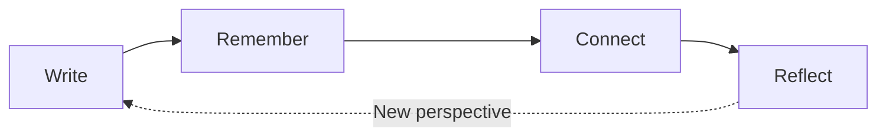
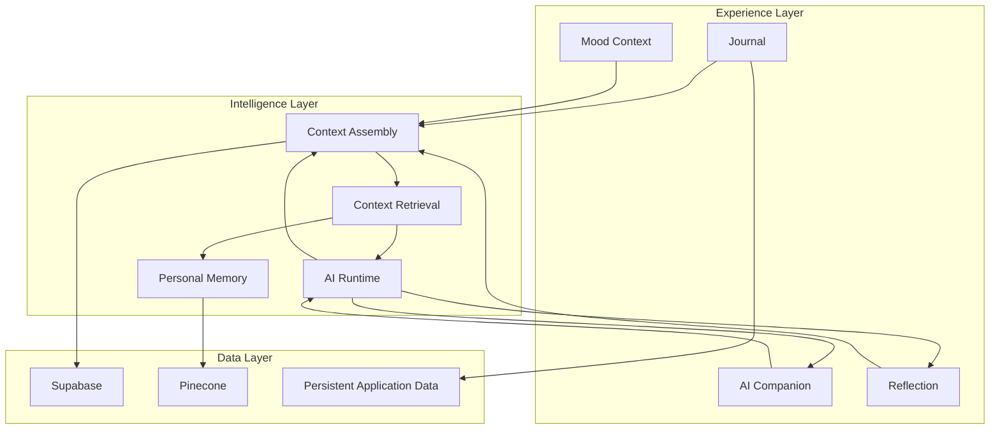
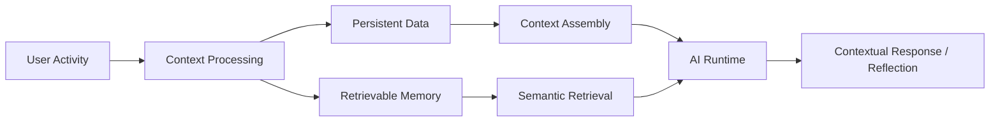

<div align="center">

# Jouspace

### Your thoughts, connected over time.

**An open-source AI-native journal for writing, remembering, connecting, and reflecting across your personal history.**

Jouspace brings journaling, contextual memory, mood, and AI-assisted reflection into one continuous space, so what you write today can remain useful months from now.

<br />

[](https://github.com/datascyther/Jouspace/stargazers)
[](https://github.com/datascyther/Jouspace/network/members)
[](https://github.com/datascyther/Jouspace/issues)
[](LICENSE)
[](https://www.typescriptlang.org/)
[](https://react.dev/)

<br />

**Journal first. AI when useful. Your history stays meaningful.**

</div>

---

## About Jouspace

Most journals are good at storing thoughts.

The problem is that stored thoughts eventually become an archive.

Something you wrote three months ago may explain what you are thinking today, but conventional journaling software rarely understands that relationship.

AI chat has almost the opposite problem. It can be useful in the moment, yet without meaningful continuity, every conversation risks becoming another isolated interaction.

**Jouspace explores what happens when those two ideas are combined.**

It treats your writing, conversations, mood context, and reflections as parts of a growing personal history.

Instead of making AI the center of the experience, Jouspace makes **your context** the center.

The AI exists as a reflective layer over that context.

---

## The Product Thesis

> **A personal space where writing, memory, mood, and AI context accumulate over time.**

Jouspace is built around a simple idea:

**Personal software becomes more useful when it understands continuity.**

A journal entry should not become irrelevant once it leaves the top of a timeline.

A conversation should not automatically become disconnected from everything that came before it.

A mood entry should provide context, not merely become another point on a chart.

Jouspace is designed to make accumulated history useful again.

---

## The Core Loop



### Write

Capture thoughts freely.

Jouspace is designed around **freeform writing first**. AI prompts and assistance should support the writing process rather than turn journaling into a questionnaire.

### Remember

Preserve useful context across time.

Entries, conversations, reflections, and supporting signals can contribute to a persistent personal context instead of existing as disconnected records.

### Connect

Find relationships across your history.

Past ideas, recurring themes, emotional context, and related moments can become discoverable when they matter again.

### Reflect

Use AI to examine your own context.

The goal is not to outsource thinking to an assistant. It is to create a system capable of helping you look back at your own history with more context.

---

## What Makes Jouspace Different?

Jouspace is **not simply a journal with an AI chat box attached to it**.

Its architecture is being developed around longitudinal context.

| Conventional approach | Jouspace approach |
| --- | --- |
| Entries become an archive | Entries contribute to persistent context |
| AI reacts to the current prompt | AI can reason over relevant historical context |
| Mood is treated as the product | Mood acts as supporting context |
| Chat is the primary experience | AI exists across the broader product |
| Memory means chat history | Memory represents useful personal context |
| AI constantly tries to engage | User agency remains central |
| Journaling is structured around prompts | Freeform writing comes first |

The objective is not more AI.

The objective is **better continuity**.

---

## Jouspace Intelligence Model

The conceptual hierarchy for Jouspace's AI is:

<div align="center">

### Mirror first · Companion second · Scribe third

</div>

**Mirror first**

The system should help surface patterns, connections, contradictions, and relevant pieces of your own history.

**Companion second**

Conversation remains important, but useful conversation should emerge from context rather than artificial personality alone.

**Scribe third**

AI can assist with organization, recall, summarization, and reflection without replacing the user's own voice.

---

## Core Experiences

### Journal

A persistent writing space designed around freeform thought.

Journal entries are not disposable documents. They become part of the historical context that can make future reflection more useful.

### AI Companion

A conversational interface connected to the broader Jouspace context.

The companion is primarily user-initiated and designed to respond using relevant personal context when appropriate.

### Memory

Jouspace explores persistent personal memory beyond ordinary conversation history.

The goal is to retrieve **relevant context**, not dump an entire history into every model request.

### Connections

As history grows, previously separate moments can become related.

Connections may emerge across journal entries, conversations, recurring subjects, reflections, and contextual signals.

### Mood Context

Mood remains part of Jouspace, but it does not define the product.

Instead, mood acts as another contextual signal that can help make historical reflection more meaningful.

### Reflection

Reflection sits above raw storage.

Rather than merely showing what happened, Jouspace is designed to help users revisit their own history and understand how different moments may relate.

---

## System Architecture

Jouspace separates the product experience from the intelligence and persistence layers.



The important distinction is that **memory, retrieval, and generation are separate concerns**.

This makes it possible to retrieve relevant context selectively instead of treating every previous interaction as permanent prompt baggage.

---

## Memory Architecture

A useful personal AI system needs more than a long chat transcript.

Conceptually, Jouspace treats memory as a pipeline:



The long-term objective is simple:

> Retrieve what matters when it matters.

Not every stored event deserves permanent attention.

---

## Technology

Jouspace is being built as a full-stack AI product rather than a thin interface around a model API.

### Application

- **React 19** — primary web UI
- **React Native** — cross-platform application architecture
- **Expo** — native application tooling
- **TypeScript** — type-safe application development
- **Vite** — web development and production builds
- **NativeWind / Tailwind CSS** — UI styling
- **Zustand** — client state management
- **TanStack Query** — asynchronous server-state management

### Data & Intelligence

- **Supabase** — application data and authentication infrastructure
- **Pinecone** — vector retrieval and semantic memory infrastructure
- **LLM runtime** — contextual AI generation and reflection
- **RAG** — selective retrieval of relevant context

### Engineering

- **Vitest** — testing
- **Zod** — runtime validation
- **GitHub** — source control and project collaboration

---

## Repository Structure

The project is evolving, but the repository broadly separates product surfaces, shared application logic, backend infrastructure, AI services, and supporting scripts.

```text
Jouspace/
├── src/                 # Web application and shared product code
├── app/                 # Application routes / experiences
├── components/          # Reusable interface components
├── backend/             # Backend and AI infrastructure
├── scripts/             # Development and infrastructure utilities
├── docs/                # Technical and product documentation
├── public/              # Public assets
├── package.json
└── README.md
```

> The exact structure may evolve as the Jouspace migration and architecture continue to mature.

---

## Getting Started

### Prerequisites

Before running Jouspace locally, install:

- **Node.js 20+**
- **npm**
- **Git**

Verify your environment:

```bash
node --version
npm --version
git --version
```

---

### 1. Clone the repository

```bash
git clone https://github.com/datascyther/Jouspace.git
cd Jouspace
```

### 2. Install dependencies

```bash
npm install
```

### 3. Configure the environment

Jouspace relies on external services for parts of its data and intelligence infrastructure.

Create your local environment configuration based on the environment templates and documentation available in the repository.

**Never commit secrets or API keys to source control.**

### 4. Start the web application

```bash
npm run dev
```

### 5. Create a production build

```bash
npm run build
```

### 6. Preview the production build

```bash
npm run preview
```

---

## Available Scripts

| Command | Purpose |
| --- | --- |
| `npm run dev` | Start the Vite development server |
| `npm run build` | Create the production web build |
| `npm run preview` | Preview the production build |
| `npm run test` | Run the test suite |
| `npm run test:integration` | Run backend integration tests |
| `npm run dev:expo` | Start the Expo development environment |
| `npm run android` | Run the Android application |
| `npm run ios` | Run the iOS application |
| `npm run web:expo` | Start the Expo web target |
| `npm run rag:ingest` | Run the RAG ingestion workflow |
| `npm run pinecone:describe` | Inspect Pinecone configuration |
| `npm run pinecone:stats` | Inspect Pinecone index statistics |

---

## Product Principles

Jouspace is being developed around several constraints that influence both product and engineering decisions.

### 1. Journal first

Writing should remain useful without requiring an AI interaction.

### 2. Context over conversation volume

A system that remembers meaningfully should not need to talk constantly.

### 3. User agency

The AI should not manufacture engagement merely because it can.

### 4. Memory should be selective

More stored information does not automatically produce better intelligence.

Relevant retrieval matters more than maximum retrieval.

### 5. AI should support reflection

Jouspace should help users think with their own history rather than attempt to think for them.

### 6. Mood is context

Mood information can enrich understanding without turning Jouspace into a mood-tracking product.

### 7. Privacy is architectural

Personal context is unusually sensitive data.

Privacy, data ownership, retrieval boundaries, and secure handling must therefore be treated as engineering concerns rather than marketing copy.

---

## What Jouspace Is Not

Jouspace is **not**:

- a therapist
- a medical device
- a diagnostic system
- a crisis intervention service
- a replacement for professional healthcare
- an autonomous decision-maker
- a system intended to manufacture emotional dependency

Jouspace is an experimental open-source AI product focused on **journaling, personal context, memory, and reflection**.

---

## Project Status

> **Jouspace is under active development.**

The project is currently evolving from an earlier product direction into the Jouspace architecture and identity.

Core engineering work already exists across areas including:

- conversational AI
- contextual retrieval
- personal memory
- journaling
- mood history
- authentication
- application infrastructure
- cross-platform UI
- AI orchestration

The current work focuses on integrating those systems around the new product thesis rather than rebuilding the application simply for the sake of a rebrand.

APIs, interfaces, architecture, and product behavior may change while the project matures.

---

## Roadmap

Jouspace is being developed incrementally.

### Current direction

- [x] Establish Jouspace product thesis
- [x] Define journal-first product direction
- [x] Build conversational AI foundation
- [x] Build contextual retrieval infrastructure
- [x] Establish persistent data infrastructure
- [x] Implement mood history foundation
- [ ] Complete Jouspace identity migration
- [ ] Refine journal experience
- [ ] Connect journal history to contextual memory
- [ ] Improve longitudinal retrieval
- [ ] Develop connection discovery
- [ ] Expand reflection experiences
- [ ] Strengthen privacy and data controls
- [ ] Expand automated evaluation and testing
- [ ] Mature cross-platform experience

The roadmap is intentionally outcome-oriented. Features may change as the underlying product model is tested.

---

## Engineering Philosophy

Development follows a deliberately incremental workflow:

```text
Objective
   ↓
Implement
   ↓
Verify
   ↓
Test
   ↓
Commit
   ↓
Continue
```

Large architectural rewrites are avoided when existing engineering can be evolved safely.

The repository is intended to document not only the final product, but also the engineering decisions required to build a context-aware AI application responsibly.

---

## Contributing

Contributions, technical discussion, bug reports, and thoughtful product feedback are welcome.

### Development workflow

1. Fork the repository.

2. Create a branch:

```bash
git checkout -b feature/your-feature
```

3. Make your changes.

4. Run the relevant tests:

```bash
npm run test
```

5. Verify the production build:

```bash
npm run build
```

6. Commit using a clear message:

```bash
git commit -m "feat: describe your change"
```

7. Push your branch:

```bash
git push origin feature/your-feature
```

8. Open a Pull Request explaining:

- what changed
- why it changed
- how it was tested
- any architectural implications

### Contribution principles

Contributions should prioritize:

- correctness
- privacy
- maintainability
- accessibility
- type safety
- testability
- clear product behavior
- minimal unnecessary complexity

For substantial architectural changes, opening an issue for discussion before implementation is recommended.

---

## Security

Do not report security vulnerabilities through public GitHub issues.

Sensitive credentials, API keys, private user information, environment files, and production secrets must never be committed to the repository.

When working with Jouspace's memory and context systems, assume that stored personal information may be sensitive and design accordingly.

---

## Responsible AI

Jouspace deals with personal writing and contextual information, which creates responsibilities beyond ordinary application development.

The project therefore aims to preserve several boundaries:

- AI-generated output should not be presented as objective truth.
- Historical context can be incomplete or interpreted incorrectly.
- Retrieved memories should remain attributable to user context where practical.
- AI should avoid pretending to possess human memory or emotions.
- User control should take priority over artificial engagement.
- Sensitive personal context should be retrieved only when relevant.
- The product should remain transparent about what AI can and cannot infer.

The objective is not to create an artificial person.

It is to build better software for working with personal context.

---

## Star History

If Jouspace is useful to you, starring the repository helps other developers discover the project and gives us a pleasantly primitive but effective signal that someone on the internet cared.

[](https://star-history.com/#datascyther/Jouspace&Date)

---

## Repository Activity

<div align="center">

[](https://github.com/datascyther/Jouspace/stargazers)
[](https://github.com/datascyther/Jouspace/network/members)
[](https://github.com/datascyther/Jouspace/issues)
[](https://github.com/datascyther/Jouspace/pulls)

</div>

---

## License

This project is licensed under the terms provided in the repository's [LICENSE](LICENSE) file.

Please review the license before redistributing, modifying, or incorporating Jouspace into another project.

---

<div align="center">

# Jouspace

### Write → Remember → Connect → Reflect

**Your thoughts should become more useful with time, not disappear into an archive.**

<br />

[Repository](https://github.com/datascyther/Jouspace)
·
[Issues](https://github.com/datascyther/Jouspace/issues)
·
[Pull Requests](https://github.com/datascyther/Jouspace/pulls)
·
[Discussions](https://github.com/datascyther/Jouspace/discussions)

<br />

Built in public as an open-source exploration of AI, memory, personal context, and reflective software.

</div>
