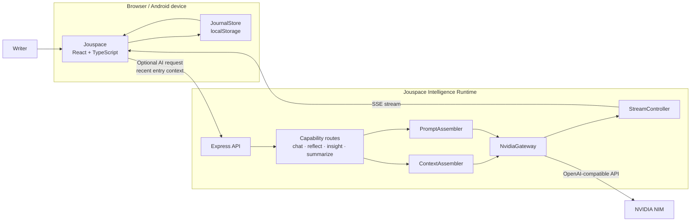

<a id="top"></a>

<br />

<div align="center">

<!-- HERO -->


<br />

**A calm, private journaling app with optional AI reflection.**
*Local-first by design. Web, PWA, and Android.*

<br />

<!-- BADGES -->
<p>
  <a href="https://github.com/datascyther/Jouspace/blob/main/LICENSE">
    
  </a>
  &nbsp;
  <a href="https://github.com/datascyther/Jouspace/releases">
    
  </a>
  &nbsp;
  <a href="https://github.com/datascyther/Jouspace/actions/workflows/build-apk.yml">
    
  </a>
  &nbsp;
  <a href="https://react.dev/">
    
  </a>
  &nbsp;
  <a href="https://www.typescriptlang.org/">
    
  </a>
  &nbsp;
  <a href="https://vitejs.dev/">
    
  </a>
</p>

<p>
  <a href="https://github.com/datascyther/Jouspace"><strong>Repository</strong></a>
  &nbsp;·&nbsp;
  <a href="https://github.com/datascyther/Jouspace/releases"><strong>Download APK</strong></a>
  &nbsp;·&nbsp;
  <a href="https://jouspace-runtime.jouspace.workers.dev"><strong>Live AI Runtime</strong></a>
  &nbsp;·&nbsp;
  <a href="./DEPLOYMENT.md"><strong>Deployment Guide</strong></a>
</p>

<br />

</div>

---

<div align="center">

### Philosophy

```text
Your journal should feel personal, quiet, and yours.
```

Jouspace stores entries on your device by default and only sends journal context to an AI runtime when *you* explicitly ask for it.

</div>

---

## ✦ What is Jouspace?

**Jouspace** is a serene private journaling application designed around calm writing, personal ownership, and optional AI-assisted reflection.

It is composed of two parts:

| Component | Role |
| --- | --- |
| **Jouspace Frontend** | React 19 + TypeScript + Vite 7 + Tailwind 4. Web, PWA, and Android (Capacitor) |
| **Jouspace Intelligence Runtime** | Express 4 server that orchestrates a hosted **NVIDIA NIM** model and streams responses back through SSE |

> [!IMPORTANT]
> Jouspace is designed to feel like an **on-device AI experience**, but model inference is performed by the configured remote runtime. **AI features are entirely optional.**

---

## ✦ Highlights

<table>
<tr>
<td width="50%" valign="top">

### ◈ Private by default

Journal entries live on your device through browser or WebView `localStorage`. The core journal works without an account and without any cloud database.

</td>
<td width="50%" valign="top">

### ◈ AI when you ask for it

Reflection, insight, chat, and summaries are routed through an opt-in runtime. The AI layer remains isolated from the storage layer.

</td>
</tr>
<tr>
<td width="50%" valign="top">

### ◈ Streaming experience

All AI responses are streamed through **Server-Sent Events** for a responsive, conversational feel.

</td>
<td width="50%" valign="top">

### ◈ Web, PWA, Android

The same frontend powers browser mode, a self-hosted PWA, and a committed Capacitor Android shell with permanent release signing.

</td>
</tr>
<tr>
<td width="50%" valign="top">

### ◈ Portable by design

Export and import journal data as JSON. The storage layer is isolated behind `JournalStore` for a future cloud sync.

</td>
<td width="50%" valign="top">

### ◈ Stateless runtime

The Jouspace Intelligence Runtime requires no database. Context is sent by the client with each request, with seed fallback only.

</td>
</tr>
</table>

---

## ✦ Project addresses

| Resource | Address |
| --- | --- |
| Source repository | [github.com/datascyther/Jouspace](https://github.com/datascyther/Jouspace) |
| Live AI Runtime | [jouspace-runtime.jouspace.workers.dev](https://jouspace-runtime.jouspace.workers.dev) |
| Releases and APKs | [github.com/datascyther/Jouspace/releases](https://github.com/datascyther/Jouspace/releases) |
| Deployment guide | [`DEPLOYMENT.md`](./DEPLOYMENT.md) |

---

## ✦ Technology stack

| Layer | Technology |
| --- | --- |
| **Frontend framework** | React 19, TypeScript |
| **Build tooling** | Vite 7, `vite-plugin-singlefile` |
| **Styling** | Tailwind CSS 4 |
| **PWA** | Manifest, branded icons, self-hosted offline fonts in `public/` |
| **AI Runtime** | Express 4, OpenAI SDK, NVIDIA NIM gateway, SSE streaming |
| **Runtime hosting** | Cloudflare Workers |
| **Mobile shell** | Capacitor with a committed `android/` platform |
| **Authentication** | Optional Firebase Auth (Google, email/password) |
| **Storage** | Local-first journal persistence through `localStorage` |

---

## ✦ Table of contents

| | |
| --- | --- |
| [Quick start](#-quick-start) | [Building the Android APK](#-building-the-android-apk) |
| [Architecture](#-architecture) | [Versioning](#-versioning) |
| [AI capabilities](#-ai-capabilities) | [Production and deployment](#-production-and-deployment) |
| [Runtime configuration](#-runtime-configuration) | [Available scripts](#-available-scripts) |
| [Security](#-security) | [Privacy](#-privacy) |
| [License](#-license) | |

---

<a id="quick-start"></a>

## ✦ Quick start

### 1. Clone the repository

```bash
git clone https://github.com/datascyther/Jouspace.git
cd Jouspace
```

### 2. Install dependencies

```bash
# Frontend dependencies
npm install

# Intelligence Runtime dependencies
cd server
npm install
cd ..
```

### 3. Configure the runtime

Create the runtime environment file:

```bash
touch server/.env
```

Add your NVIDIA NIM API key:

```dotenv
NVIDIA_API_KEY=your_nvidia_nim_key
```

> [!CAUTION]
> `server/.env` is **gitignored**. Never commit model provider credentials to the repository.

### 4. Start the complete development environment

```bash
npm run dev:all
```

| Service | Local address |
| --- | --- |
| Jouspace frontend | `http://localhost:5173` |
| Intelligence Runtime | `http://localhost:3001` |

During development, the frontend calls `/api/ai/*` on its own origin and Vite proxies those requests to the local runtime on port `3001`.

---

<a id="architecture"></a>

## ✦ Architecture



### ◈ Frontend responsibilities

```text
React application
├── AI chat
├── Reflection drawer
├── Insight cards
├── Writing summaries
├── Local JournalStore
└── useJouspaceIntelligence(capability)
      └── POST {runtime}/api/ai/<capability>
```

The frontend:

- Stores journal entries locally
- Selects recent entries as context for AI requests
- Connects to the runtime through a configurable base URL
- Consumes AI output as an SSE stream
- Keeps AI functionality optional and separate from the core journal

### ◈ Intelligence Runtime responsibilities

```text
server/
├── routes/
│   └── chat · reflect · insight · summarize
├── ContextAssembler
│   └── Assembles journal context from client-supplied entries
├── PromptAssembler
│   └── Creates Jouspace-branded system prompts per capability
├── gateway/
│   └── NvidiaGateway (live implementation)
└── StreamController
    └── Converts AsyncIterable output into SSE responses
```

The runtime is intentionally **stateless**. It does not require a database and uses seed data only when the client provides no entries.

---

<a id="ai-capabilities"></a>

## ✦ AI capabilities

All AI features are exposed under:

```text
POST /api/ai/<capability>
```

| Capability | Purpose | Output |
| --- | --- | --- |
| `chat` | Conversational exploration of thoughts and journal context | SSE stream |
| `reflect` | Calm reflection on an entry or recent writing | SSE stream |
| `insight` | Extraction of themes, patterns, or useful observations | SSE stream |
| `summarize` | Concise summaries of recent journal activity | SSE stream |

The runtime remains stateless. Journal context is supplied by the client with each request.

---

<a id="runtime-configuration"></a>

## ✦ Runtime configuration

### Development

No frontend runtime URL is required during local development:

```text
Frontend /api/ai/*  →  Vite proxy  →  localhost:3001
```

### Deployed PWA or Android APK

Set `VITE_API_BASE_URL` when creating the production build:

```bash
VITE_API_BASE_URL=https://your-runtime-host.example npm run build
```

For the hosted Jouspace runtime:

```bash
VITE_API_BASE_URL=https://jouspace-runtime.jouspace.workers.dev npm run build
```

> [!NOTE]
> A build does not have to use the public runtime. A build may ship without a default runtime and let the user configure one from Profile.

### CORS

The runtime already permits the standard Capacitor WebView origins:

```text
capacitor://localhost
https://localhost
```

Add other permitted origins through the runtime's `CORS_ORIGINS` environment variable:

```dotenv
CORS_ORIGINS=https://journal.example.com,https://preview.example.com
```

---

<a id="building-the-android-apk"></a>

## ✦ Building the Android APK

The `android/` platform is committed to the repository and includes:

- Branded application icons
- Native permissions
- Capacitor configuration
- Permanent release-signing configuration
- A reproducible Gradle release pipeline

The web application builds into `dist/`, with application JavaScript and CSS inlined into a single `dist/index.html`. Capacitor then synchronizes the build into the native Android shell.

### ◈ Option A — GitHub Actions

**Recommended: no local Android toolchain required.**

1. Push the repository to GitHub
2. Open **Actions**
3. Select **Build Android APK**
4. Click **Run workflow**
5. Download `jouspace-release.apk` from the run's **Artifacts** section

The workflow is defined at:

```text
.github/workflows/build-apk.yml
```

Pipeline:

```text
Install dependencies
      ↓
Build the web application
      ↓
Run npx cap sync android
      ↓
Stamp the Android version
      ↓
Build a signed release APK
      ↓
Upload jouspace-release.apk
```

Version metadata is derived from the Git tag. For example:

```text
v1.1.0-beta.1
├── versionName: 1.1.0-beta.1
└── versionCode: 11001
```

### ◈ Option B — Local build

Local Android builds require:

- JDK 17
- Android SDK
- A configured Android build environment

```bash
npm run build
npx cap sync android

cd android
./gradlew assembleRelease
```

The generated APK is written to:

```text
android/app/build/outputs/apk/release/app-release.apk
```

> [!WARNING]
> Preserve the release keystore and its credentials. Losing the signing identity prevents future APKs from being published as updates to the same Android application.

---

<a id="versioning"></a>

## ✦ Versioning

Jouspace follows **Semantic Versioning** and uses `-beta.N` for prerelease builds.

| Git tag | Android `versionName` | Android `versionCode` |
| --- | ---: | ---: |
| `v1.1.0-beta.1` | `1.1.0-beta.1` | `11001` |
| `v1.1.0-beta.2` | `1.1.0-beta.2` | `11002` |
| `v1.1.0` | `1.1.0` | `11100` |

### Version code formula

```text
versionCode =
  MAJOR × 10000
  + MINOR × 1000
  + PATCH × 100
  + iteration
```

Where `iteration` is:

| Release type | Iteration |
| --- | --- |
| Beta release `-beta.N` | `01`–`99` (the beta number) |
| Stable release | `100` |

This ensures stable releases always sort above all beta builds of the same version.

### Release rules

1. Increment the beta number for every prerelease:

   ```text
   1.1.0-beta.1 → 1.1.0-beta.2 → 1.1.0-beta.3
   ```

2. Drop the beta suffix when promoting to stable:

   ```text
   1.1.0-beta.3 → 1.1.0
   ```

3. Keep `package.json` `version` synchronized with the Android `versionName`.

4. Trigger a release build by pushing a matching Git tag:

   ```bash
   git tag v1.1.0-beta.1
   git push origin v1.1.0-beta.1
   ```

5. Or use the **Build Android APK** workflow's manual `version` input from the GitHub Actions interface.

See [`DEPLOYMENT.md` §2.2](./DEPLOYMENT.md) for the complete release scheme.

---

<a id="production-and-deployment"></a>

## ✦ Production and deployment

### ◈ Runtime deployment

Deploy the Jouspace Intelligence Runtime to **Cloudflare Workers** by following [`DEPLOYMENT.md`](./DEPLOYMENT.md).

Then compile the client against the deployed runtime:

```bash
VITE_API_BASE_URL=https://jouspace-runtime.<subdomain>.workers.dev npm run build
```

The runtime is deliberately **stateless**:

- No journal database is required
- Journal context is supplied by the client with each AI request
- Seed context is used only when the client sends no entries
- AI provider credentials remain on the server

### ◈ Local-first data model

The frontend persists journal entries through the store implementation in:

```text
src/store/
```

Recent entries are attached to AI requests as contextual input. A future cloud-sync implementation can be introduced behind the `JournalStore` interface without rewriting the AI pipeline or journal UI.

### ◈ Optional authentication

Firebase Authentication is wired for:

- Google sign-in
- Email and password authentication

Authentication is an optional identity layer. The local journal itself remains usable without an account.

Configure Firebase web credentials in the frontend `.env` file:

```dotenv
VITE_FIREBASE_API_KEY=...
VITE_FIREBASE_AUTH_DOMAIN=...
VITE_FIREBASE_PROJECT_ID=...
VITE_FIREBASE_STORAGE_BUCKET=...
VITE_FIREBASE_MESSAGING_SENDER_ID=...
VITE_FIREBASE_APP_ID=...
```

For Android Google sign-in, add:

```text
android/app/google-services.json
```

Profile metadata such as display name and join date is stored locally. See [`DEPLOYMENT.md` §3](./DEPLOYMENT.md) for full configuration details and current authentication status.

---

<a id="available-scripts"></a>

## ✦ Available scripts

| Command | Description |
| --- | --- |
| `npm run dev` | Start the Vite development server |
| `npm run build` | Create the production frontend build in `dist/` |
| `npm run server` | Start the Intelligence Runtime with `tsx` watch mode |
| `npm run dev:all` | Run the frontend and Intelligence Runtime together |

### Common workflows

```bash
# Frontend only
npm run dev
```

```bash
# Runtime only
npm run server
```

```bash
# Full local development environment
npm run dev:all
```

```bash
# Production web build
npm run build
```

---

<a id="security"></a>

## ✦ Security

Jouspace keeps sensitive runtime behavior on the server side and treats the client as untrusted input.

### ◈ API key isolation

The NVIDIA API key lives only in the runtime environment:

```text
server/.env
```

It is never embedded in the frontend bundle or sent to the client.

### ◈ System prompt protection

Client-supplied messages with the `system` role are rejected or ignored. The runtime injects its own capability-specific system prompt through `PromptAssembler`.

### ◈ Reasoning privacy

Model `reasoning_content` is consumed and discarded by the runtime. Chain-of-thought output is never forwarded through the SSE stream.

### ◈ Safe error responses

The global error handler returns a generic response:

```json
{
  "error": "Intelligence unavailable"
}
```

Stack traces and internal runtime details are never exposed to the client.

### ◈ Stateless request handling

The runtime does not require persistent journal storage. Context is assembled from entries included with the current request.

---

<a id="privacy"></a>

## ✦ Privacy

Jouspace is designed as a **local-first journal**.

### ◈ What remains on the device

By default, journal entries are stored in the browser's `localStorage` or in the Android app's WebView storage.

The core journaling experience does not require:

- A Jouspace account
- A cloud journal database
- Analytics
- Telemetry
- Remote entry logging
- AI access

### ◈ When AI is enabled

AI features are opt-in. When a runtime is configured and an AI action is requested:

```text
1. The client selects relevant journal context
2. That context is sent to the configured runtime
3. The runtime sends the prompt to its configured model provider
4. The generated response is streamed back to the app
```

Choose a runtime and model provider you trust. Their infrastructure and privacy terms apply to the content intentionally submitted for AI processing.

> [!IMPORTANT]
> A default build may ship without a runtime configured. In that case, the AI interface remains inactive until a runtime URL is added in Profile.

### ◈ Export and import

Profile includes JSON export and import so journal data remains portable and under the user's control.

### ◈ Device-local data risk

Because journal data is stored locally, the following actions may permanently erase it:

- Uninstalling the application
- Clearing browser or WebView storage
- Resetting the device
- Removing application data

Export your journal regularly and keep backups in a secure location.

---

<a id="license"></a>

## ✦ License

Jouspace is released under the [MIT License](./LICENSE).

```text
Copyright © Jouspace contributors
SPDX-License-Identifier: MIT
```

---

<div align="center">

<br />


**Built for quieter thoughts, private writing, and more intentional reflection.**

<br />

[Back to top ↑](#top)

</div>
